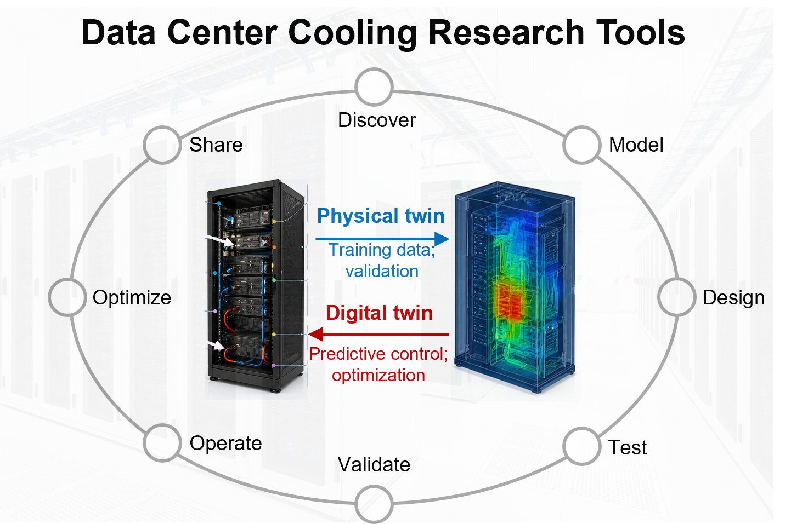

# Data Center Cooling Research Tools



A hub for researchers working on data center cooling, thermal management, liquid cooling, facility energy modeling, control, testing, and digital twins.

The goal is not to promote one model, one solver, or one lab codebase. This repository is meant to be a one-stop starting point for finding useful tools across the full cooling stack: from bubble and droplet physics to chip/package cooling, rack liquid loops, CDUs, facility simulation, PUE/WUE/ERE accounting, heat reuse, and AI-assisted operation.

## Scope

Included resources should help researchers design, model, test, monitor, optimize, or evaluate data center cooling systems. The library can include open-source repositories, commercial tools, standards, datasets, benchmark environments, papers with reusable artifacts, and practical workflows.

## Navigation

- [Fundamental Thermal-Fluid Mechanisms](#fundamental-thermal-fluid-mechanisms)
- [Chip, Package, And Server Cooling](#chip-package-and-server-cooling)
- [Rack, CDU, And Liquid Loop Systems](#rack-cdu-and-liquid-loop-systems)
- [Room, Building, And Campus Modeling](#room-building-and-campus-modeling)
- [AI, Control, Digital Twins, And Operations](#ai-control-digital-twins-and-operations)
- [System Metrics, Standards, And Accounting](#system-metrics-standards-and-accounting)
- [Skills, Agents, And Plugin Collections](#skills-agents-and-plugin-collections)
- [Discovery Sources](#discovery-sources)
- [Repository Review Workflow](#repository-review-workflow)
- [Entry Format](#entry-format)

## Fundamental Thermal-Fluid Mechanisms

Tools and workflows for understanding the physics behind cooling technologies.

| Resource | Type | Scale | Notes |
| --- | --- | --- | --- |
| Bubble dynamics analysis | Research workflow | Bubble/boiling | High-speed imaging, segmentation, tracking, velocity, departure diameter, frequency, coalescence, and uncertainty analysis. |
| Droplet dynamics analysis | Research workflow | Spray/evaporation | Droplet impact, spreading, rebound, evaporation, spray cooling, and heat-transfer characterization. |
| Acoustic emission and flow visualization workflows | Experimental workflow | Boiling/two-phase | Useful for boiling regime identification, event detection, and multimodal diagnostics. |
| IR thermography workflows | Experimental workflow | Chip/surface | Useful for chip power maps, thermal maps, boiling surfaces, and validation of simulations. |
| [cldunlap73/BubbleID](https://github.com/cldunlap73/BubbleID) | Open-source research code / paper artifact | Pool boiling / bubble dynamics | Deep-learning framework for bubble interface dynamics analysis using segmentation, tracking, and classification models; supports departure classification, interface velocity prediction, and bubble-statistics extraction from manually labeled pool-boiling imagery. |
| [UARK-NED3/BubbleID-Flow](https://github.com/UARK-NED3/BubbleID-Flow) | Lab research workflow | Flow boiling / bubble segmentation | Adaptation workspace for applying BubbleID-style segmentation to flow-boiling images, including flow-channel ROI preprocessing, high-speed BMP sequence support, COCO annotation utilities, Mask R-CNN fine-tuning configs, and bubble-mask validation scripts. |
| [UARK-NED3/FlowLab](https://github.com/UARK-NED3/FlowLab) | Lab experimental toolkit | Single-phase and two-phase liquid cooling | Research toolkit for flow-loop, heater-power, acoustic-emission, and accelerometer measurements in microchannel liquid-cooling experiments, with protocols, multimodal data-collection guidance, example files, and analysis notebooks. |
| [UARK-NED3/AELab](https://github.com/UARK-NED3/AELab) | Lab experimental toolkit | Acoustic emission / phase change | Collaborative acoustic-emission analysis workspace for pool boiling, flow boiling, immersed partial discharge, partial discharge, and sensing-system workflows; useful for phase-change diagnostics and reproducible AE tutorials. |

## Chip, Package, And Server Cooling

Tools for heat generation, spreading, conduction, cold plates, direct-to-chip cooling, and electro-thermal design.

| Resource | Type | Scale | Notes |
| --- | --- | --- | --- |
| Ansys Icepak | Commercial solver | Electronics/package/server | Electronics cooling CFD and thermal design workflows. Include examples only when tied to reproducible assumptions or validation data. |
| Ansys Fluent | Commercial solver | Component to facility | General CFD and conjugate heat transfer; useful for cold plates, immersion, airflows, and room-scale studies when validation is documented. |
| Chip power map workflows | Data/model workflow | Chip/package | Map power density to junction temperature, hotspot risk, cooling limits, and system-level energy implications. |
| Electro-thermal co-design workflows | Design workflow | Chip/server | Joint treatment of power delivery, thermal constraints, 800 VDC architectures, reliability, and cooling requirements. |
| Smart Cooling Library | Open-source candidate | Processor/rack | Modelica thermal modeling of processors, cooling systems, loops, and rack simulation; screen before full inclusion. |
| [xenabmirza/magnetocaloric-thin-film-cooling](https://github.com/xenabmirza/magnetocaloric-thin-film-cooling) | Open-source candidate | Microchip / emerging cooling | Python/Jupyter candidate for magnetocaloric thin-film cooling concepts; no README was available during initial screening, so treat as a low-confidence candidate until reviewed. |

## Rack, CDU, And Liquid Loop Systems

Tools for rack cooling hardware, hydraulic integration, liquid loops, CDUs, rear-door heat exchangers, and immersion systems.

| Resource | Type | Scale | Notes |
| --- | --- | --- | --- |
| CDU design and sizing workflows | Design workflow | Rack/loop | Pump curves, heat exchanger sizing, controls, redundancy, approach temperature, water quality, and failure modes. |
| Direct-to-chip liquid-cooling workflows | Design/modeling workflow | Server/rack | Cold plate selection, manifold design, pressure drop, flow balancing, quick disconnects, leak detection, and serviceability. |
| Immersion cooling workflows | Design/testing workflow | Server/rack/tank | Dielectric fluid selection, boiling/single-phase behavior, material compatibility, maintenance, and electrical reliability. |
| Rear-door heat exchanger workflows | Design/modeling workflow | Rack/room | Rack heat capture, air-liquid heat exchange, fan interaction, condensation risk, and controls. |
| [2listic/datacenter-planner](https://github.com/2listic/datacenter-planner) | Open-source planning tool | Rack/room | Web-based 2D-to-3D data center planning tool for placing racks and cooling equipment; useful for layout visualization, not a validated thermal solver. |
| [LianLiTech/In-Rack-Coolant-Distribution-Unit](https://github.com/LianLiTech/In-Rack-Coolant-Distribution-Unit) | Vendor/product material | Rack/CDU | In-rack CDU and containerized data center cooling overview; useful for hardware landscape awareness, but needs datasheets or test data before engineering citation. |
| [LianLiTech/Data-Center-Liquid-Cooling-System](https://github.com/LianLiTech/Data-Center-Liquid-Cooling-System) | Vendor/product material | Rack/liquid cooling | Liquid-cooling product overview for high-density AI/HPC racks; include only as market/hardware orientation unless technical documentation is added. |

## Room, Building, And Campus Modeling

Tools for connecting component and rack innovations to facility energy use, water use, carbon, and heat reuse.

| Resource | Type | Scale | Notes |
| --- | --- | --- | --- |
| EnergyPlus | Open-source building simulator | Building/facility | Facility energy modeling, HVAC systems, weather files, economizers, heat recovery, and annual performance. |
| Modelica workflows | Modeling language/workflow | Component to facility | Useful for coupled thermal-fluid-energy systems, cooling loops, controls, and system dynamics. |
| Data-center room CFD workflows | CFD workflow | Room/facility | Air management, containment, recirculation, bypass, rack inlet temperatures, and CRAC/CRAH interactions. |
| [nuoaleon/Data-center-PUE-prediction-tool](https://github.com/nuoaleon/Data-center-PUE-prediction-tool) | Open notebooks | Facility/campus | Physics-based PUE prediction and sensitivity analysis for climate-dependent hyperscale data center cooling scenarios. |
| Heat reuse workflows | Design/accounting workflow | Facility/campus | Waste heat recovery, district heating, greenhouse/aquaculture uses, ERE accounting, economics, and temperature-grade constraints. |
| [ME421-Capstone-Project/chiller-model](https://github.com/ME421-Capstone-Project/chiller-model) | Open-source package / educational project | Chiller array / facility | Models thermal interference among nearby chillers, greedy chiller selection, aging, startup ramp, wind, and dynamic load; useful for educational facility optimization studies. |
| [femmetronics/Data-Center-Cooling-System](https://github.com/femmetronics/Data-Center-Cooling-System) | Open-source simulation / educational project | Facility/operations | Simulates cooling-mode selection and workload scheduling with water, energy, carbon, psychrometric, and workload-shifting considerations. |
| [NSTuttle/EfficiencyCalculatorWeb](https://github.com/NSTuttle/EfficiencyCalculatorWeb) | Web calculator / educational | Facility/PUE | Older HTML/CSS/JS calculator for estimating savings from PUE improvement; useful as a simple teaching reference, not a full facility model. |

## AI, Control, Digital Twins, And Operations

Tools for control, surrogate modeling, monitoring, data-driven optimization, and operational decision support.

| Resource | Type | Scale | Notes |
| --- | --- | --- | --- |
| [4g/dcool](https://github.com/4g/dcool) | Open-source example | Operations/control | Data center cooling with reinforcement learning; useful as a control research example rather than a universal validated controller. |
| [HewlettPackard/dc-rl](https://github.com/HewlettPackard/dc-rl) | Open-source environment | Operations/control | SustainDC environments for data center simulation and control, including cooling optimization, workload scheduling, battery management, and multi-agent RL. |
| [wfzheng/AlphaDataCenterCooling](https://github.com/wfzheng/AlphaDataCenterCooling) | Open-source virtual testbed | Cooling control / Modelica | Dockerized data center cooling simulation service with a Gymnasium environment, Modelica/FMU resources, and real-data-based cooling-system structure for testing control strategies. |
| [kardashev-lab/datacenter-cooling-sim](https://github.com/kardashev-lab/datacenter-cooling-sim) | Open-source simulation framework | AI workload / cooling / telemetry | Combines AI workload simulation, thermal/cooling simulation, AlphaDataCenterCooling adapters, Prometheus/Grafana telemetry, and dashboard components; needs deeper validation review. |
| [vk22006/predictive-cooling-optimizer-for-data-centers](https://github.com/vk22006/predictive-cooling-optimizer-for-data-centers) | Open-source notebook / dashboard | Chiller scheduling / predictive control | Temperature-aware chiller scheduling project using feature engineering, XGBoost energy and temperature models, and constraint-based optimization; useful as an educational predictive-control example. |
| [imamdoula004/AI-Hybrid-EMPC-DataCenter-Cooling](https://github.com/imamdoula004/AI-Hybrid-EMPC-DataCenter-Cooling) | Paper artifact / simulation code | Predictive control / digital twin | Simulation code for an IEEE manuscript on LSTM forecasting, hybrid economic MPC, PID fallback, cyber-physical resilience, cost, carbon, and ASHRAE thermal constraints. |
| [Jalaljalili/Cooling-Dynamic-Model](https://github.com/Jalaljalili/Cooling-Dynamic-Model) | Open-source educational model | Dynamic modeling / PID control | RC thermal model with transfer functions, Bode plots, PID response comparison, disturbance injection, actuator limits, and closed-loop visualization. |
| [D1D104/fuzzy-miso-datacenter-cooling](https://github.com/D1D104/fuzzy-miso-datacenter-cooling) | Open-source control prototype | Fuzzy CRAC control | Fuzzy MISO/Mamdani controller for CRAC power control with MQTT and Node-RED monitoring; useful as a lightweight control teaching/prototyping reference. |
| [Lucabr01/RL-and-Gradient-Free-Based-Datacenter-Cooling-Controller](https://github.com/Lucabr01/RL-and-Gradient-Free-Based-Datacenter-Cooling-Controller) | Open-source educational project | EnergyPlus/Gymnasium control | Sinergym/EnergyPlus-based data center HVAC control study comparing Soft Actor-Critic and evolutionary strategies for energy and thermal-safety objectives. |
| [rishithayanidhi/Data_Center_Cooling_Optimization_Environment](https://github.com/rishithayanidhi/Data_Center_Cooling_Optimization_Environment) | Open-source RL environment | Multi-zone cooling control | FastAPI/Hugging Face style environment for multi-zone temperature management, energy optimization, and RL-based autonomous control; needs validation review. |
| [SohelHossain1218/Smart-IoT-Data-Center-Cooling-Environment-Monitor](https://github.com/SohelHossain1218/Smart-IoT-Data-Center-Cooling-Environment-Monitor) | Open-source hardware prototype | Server-room monitoring/control | ESP8266-based environmental monitoring and dual-AC control with temperature, humidity, air quality, smoke sensing, OLED, Telegram alerts, and manual override. |
| [eeyx1/cooling-fan-predictive-maintenance-digital-twin](https://github.com/eeyx1/cooling-fan-predictive-maintenance-digital-twin) | Open-source digital twin prototype | Cooling fan maintenance | ESP32/MQTT/Python BMS dashboard for cooling-fan condition monitoring, anomaly detection, simulated validation, evidence logging, and feedback-based retraining. |
| [iaziz6/Digital-Twin-for-Data-Center-Cooling](https://github.com/iaziz6/Digital-Twin-for-Data-Center-Cooling) | Open-source candidate | Rack cooling digital twin | Physics-regularized 3D U-Net concept for rack cooling with uncertainty quantification; README is minimal, so keep as a candidate until deeper code/paper review. |
| [xiaodongwang991481/energy_saving](https://github.com/xiaodongwang991481/energy_saving) | Open-source candidate | ML energy saving | Machine-learning project for data center cooling energy saving; README is minimal, so keep as a low-confidence candidate pending code review. |
| Digital twin workflows | Modeling/operations workflow | Rack/facility | Sensor fusion, reduced-order models, uncertainty, calibration, anomaly detection, control, and what-if analysis. |
| [UARK-NED3/CFDTwin](https://github.com/UARK-NED3/CFDTwin) | Lab desktop app / surrogate workflow | CFD surrogate modeling | Wizard-based desktop app for building POD plus neural-network surrogate models from Ansys Fluent simulations, including case loading, DOE sampling, batch simulation, training, validation, and Fluent comparison workflows. |
| CFDTwin-style surrogate workflows | Research workflow | Component/facility | CFD automation, design of experiments, POD/reduced-order modeling, neural surrogate training, and validation. |

## System Metrics, Standards, And Accounting

Resources that connect cooling innovations to system-level outcomes.

| Resource | Type | Scale | Notes |
| --- | --- | --- | --- |
| PUE calculation workflows | Accounting workflow | Facility/campus | Include IT power, cooling power, power delivery, component-level innovation effects, weather, controls, and annualization. |
| WUE and water accounting | Accounting workflow | Facility/campus | Water-side economizers, evaporative cooling, cooling towers, regional water stress, and treatment requirements. |
| ERE and heat reuse accounting | Accounting workflow | Facility/campus | Captures useful exported heat and clarifies when heat reuse improves system performance. |
| ASHRAE thermal guidelines | Standard/guideline | IT/facility | Operating envelopes, allowable conditions, environmental classes, and data center thermal management guidance. |
| Reliability and serviceability metrics | Evaluation workflow | Component to facility | Leak risk, maintainability, redundancy, uptime, pump/fan failure, fouling, corrosion, and instrumentation drift. |

## Skills, Agents, And Plugin Collections

Agent skills and plugin collections can help researchers run literature reviews, screen data center opportunities, automate facility-control workflows, and preserve reproducible engineering reasoning. Include them when they support research work; do not treat them as substitutes for validated thermal-fluid models, calibrated experiments, or engineering judgment.

| Resource | Type | Scale | Notes |
| --- | --- | --- | --- |
| [Mechanical Engineering Research Skill](https://github.com/hanhuark/mechanical-engineering-research-skill) | Agent skill | Thermal-fluid research workflow | Source-aware workflow for heat transfer, fluid mechanics, HVAC, energy systems, CFD, experiments, AI/ML, research coding, proposals, and technical writing. Useful as a domain-specific research assistant for data center cooling studies. |
| [Imbad0202/academic-research-skills](https://github.com/Imbad0202/academic-research-skills) | Plugin/skill collection | Research workflow | Academic research skills for literature review, paper planning, writing, review, citation checking, and publication workflows. Useful for cooling researchers preparing reviews, manuscripts, and proposal background sections. |
| [Data Center Due Diligence Orchestrator](https://mcpmarket.com/tools/skills/data-center-due-diligence-orchestrator) | Agent skill | Site/facility/investment workflow | Coordinates multi-domain data center due diligence across power, connectivity, land, environmental, and commercial factors. Relevant for site selection, infrastructure risk, and early-stage facility cooling constraints. |
| [Sensibo Automation](https://mcpmarket.com/tools/skills/sensibo-automation) | Agent skill / MCP workflow | Building HVAC/control | Automates Sensibo-connected climate control and monitoring. Mostly adjacent to data centers, but relevant for building-level HVAC control experiments, small lab test spaces, and AI-driven climate-control workflow prototypes. |
| [HyperYJ/ai-liquid-council](https://github.com/HyperYJ/ai-liquid-council) | Agent skill | AI data center liquid cooling due diligence | Chinese/English-oriented skill for evaluating liquid-cooling projects, companies, direct-to-chip vs immersion routes, CDUs, manifolds, QDs, retrofit constraints, and investment/technical diligence. |

## Discovery Sources

Use these sources to find candidate entries. Candidates should be screened before inclusion.

| Source | Why Use It | Screening Notes |
| --- | --- | --- |
| [GitHub search: data center cooling](https://github.com/search?q=data%20center%20cooling&type=repositories) | Cooling-targeted repository discovery; currently surfaces PUE, AI control, rack planning, hybrid cooling, and Modelica candidates. | Primary GitHub mining stream. Check documentation, maintenance, scope, validation, and cooling relevance. |
| [GitHub topic: data-center](https://github.com/topics/data-center) | Broad data-center repository discovery; includes DCIM, telemetry, simulators, workload scheduling, networking, and operations. | Secondary stream. Include only when the cooling, energy, sustainability, telemetry, or hardware-management link is explicit. |
| Paper artifact links | Reproducible research code and datasets. | Prefer papers with clear model assumptions, validation, and reusable data or scripts. |
| Standards and professional societies | High-confidence definitions and test guidance. | Include stable links and note whether access is open or paid. |
| Vendor examples and documentation | Practical workflows for commercial solvers and hardware. | Avoid marketing-only entries; prefer technical examples, manuals, or validation cases. |

## Repository Review Workflow

GitHub search should be used as a candidate-mining workflow, not as automatic evidence. Search-derived repositories should be screened, reviewed, and then either cited in the main README, placed in an adjacent/educational section, or excluded.

- Review protocol: [docs/repo-review-workflow.md](docs/repo-review-workflow.md)
- Initial candidate queue: [docs/candidate-repos.md](docs/candidate-repos.md)
- Initial review log: [docs/review-log-2026-05-20.md](docs/review-log-2026-05-20.md)

## Entry Format

Use concise entries so the README remains scannable.

```markdown
| [Tool or resource](https://example.com) | Open-source/commercial/standard/dataset/workflow | Scale | What it is useful for, key inputs/outputs, and any validation caveat. |
```

Recommended tags:

- Scale: mechanism, chip, package, server, rack, CDU, loop, room, building, campus, operations.
- Workflow: design, modeling, simulation, testing, data reduction, control, monitoring, optimization, accounting.
- Evidence: standard, peer-reviewed, validated model, benchmark, educational example, commercial workflow, emerging research.
- Metrics: junction temperature, thermal resistance, HTC, CHF, pressure drop, pumping power, fan power, rack kW, PUE, WUE, ERE, TCO, carbon.

## Contributing

Contributions are welcome when they improve the usefulness of the hub for data center cooling researchers. Please read [CONTRIBUTING.md](CONTRIBUTING.md) before adding entries.
