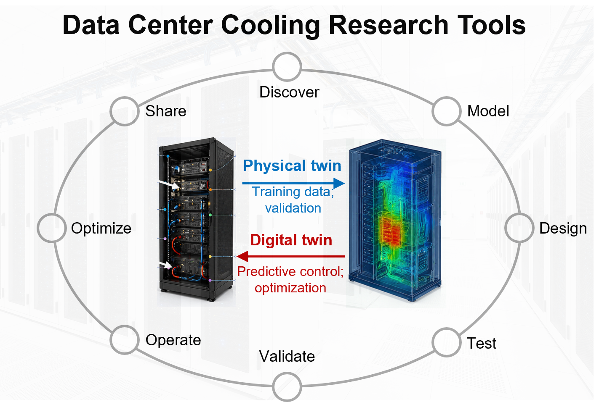
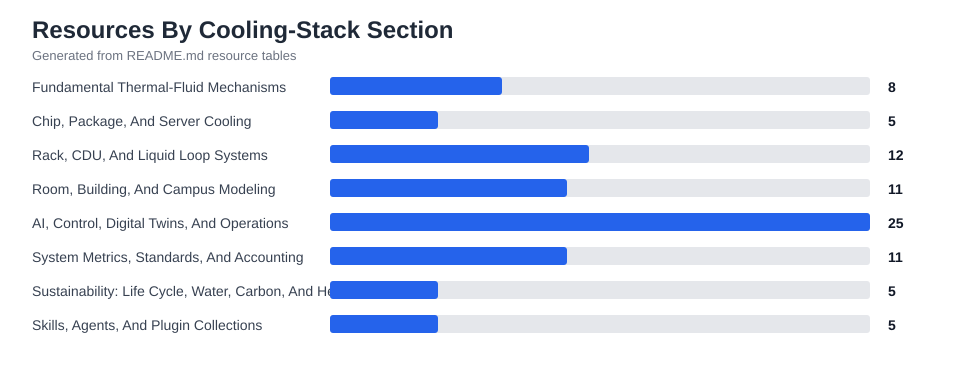

# Data Center Cooling Research Tools



A hub for researchers working on data center cooling, thermal management, liquid cooling, facility energy modeling, control, testing, and digital twins.

The goal is not to promote one model, one solver, or one lab codebase. This repository is meant to be a one-stop starting point for finding useful tools across the full cooling stack: from bubble and droplet physics to chip/package cooling, rack liquid loops, CDUs, facility simulation, PUE/WUE/ERE accounting, heat reuse, and AI-assisted operation.

## Scope

Included resources should help researchers design, model, test, monitor, optimize, or evaluate data center cooling systems. The library can include open-source repositories, commercial tools, standards, datasets, benchmark environments, papers with reusable artifacts, and practical workflows.

## Quick Start

- If you need a tool for a specific research task, start with the [user guide](docs/user-guide.md).
- If you want the current coverage summary, open the [generated catalog summary](docs/generated/catalog_summary.md) or the [trend summary](docs/trends.md).
- If you want to refresh the repository, follow the [refresh playbook](docs/refresh-playbook.md) and run `python scripts/discover_github_repos.py`.
- If you want to cite or describe this hub, use the arXiv manuscript draft in [paper/arxiv/main.tex](paper/arxiv/main.tex).

## Navigation

- [Quick Start](#quick-start)
- [Generated Catalog Snapshot](#generated-catalog-snapshot)
- [Fundamental Thermal-Fluid Mechanisms](#fundamental-thermal-fluid-mechanisms)
- [Chip, Package, And Server Cooling](#chip-package-and-server-cooling)
- [Rack, CDU, And Liquid Loop Systems](#rack-cdu-and-liquid-loop-systems)
- [Room, Building, And Campus Modeling](#room-building-and-campus-modeling)
- [AI, Control, Digital Twins, And Operations](#ai-control-digital-twins-and-operations)
- [System Metrics, Standards, And Accounting](#system-metrics-standards-and-accounting)
- [Sustainability: Life Cycle, Water, Carbon, And Heat Reuse](#sustainability-life-cycle-water-carbon-and-heat-reuse)
- [Skills, Agents, And Plugin Collections](#skills-agents-and-plugin-collections)
- [Discovery Sources](#discovery-sources)
- [Repository Review Workflow](#repository-review-workflow)
- [Entry Format](#entry-format)

## Generated Catalog Snapshot

The catalog is maintained as readable Markdown tables in this README. Generated CSV tables and SVG figures are built from those tables so readers can quickly see coverage by cooling-stack layer, evidence status, and workflow tag.



- Full generated summary: [docs/generated/catalog_summary.md](docs/generated/catalog_summary.md)
- Parsed resource CSV: [docs/generated/catalog_resources.csv](docs/generated/catalog_resources.csv)
- Validation review queue: [docs/generated/validation_review_queue.md](docs/generated/validation_review_queue.md)
- Validation execution matrix: [docs/generated/validation_execution_matrix.md](docs/generated/validation_execution_matrix.md)
- Validation runbook: [docs/generated/validation_runbook.md](docs/generated/validation_runbook.md)
- Validation next actions: [docs/generated/validation_next_actions.md](docs/generated/validation_next_actions.md)
- Validation debt report: [docs/generated/validation_debt_report.md](docs/generated/validation_debt_report.md)
- Catalog quality report: [docs/generated/catalog_quality_report.md](docs/generated/catalog_quality_report.md)
- Trends and interpretation: [docs/trends.md](docs/trends.md)
- Runtime prerequisite check: `powershell -ExecutionPolicy Bypass -File scripts/check_runtime_prereqs.ps1`
- Regeneration command: `python scripts/build_catalog_assets.py`

The generated labels are curation aids, not validation stamps. Use each row's note, `validation_basis`, `run_status`, `artifact_status`, `reviewed_on`, `validation_signal`, `review_priority`, validation execution track, validation runbook evidence packet, validation next-action rank, validation debt age, and linked source before treating a resource as engineering evidence.

## Fundamental Thermal-Fluid Mechanisms

Tools and workflows for understanding the physics behind cooling technologies.

| Resource | Type | Scale | Notes |
| --- | --- | --- | --- |
| Bubble dynamics analysis | Research workflow | Bubble/boiling | High-speed imaging, segmentation, tracking, velocity, departure diameter, frequency, coalescence, and uncertainty analysis. |
| Droplet dynamics analysis | Research workflow | Spray/evaporation | Droplet impact, spreading, rebound, evaporation, spray cooling, and heat-transfer characterization. |
| Acoustic emission and flow visualization workflows | Experimental workflow | Boiling/two-phase | Useful for boiling regime identification, event detection, and multimodal diagnostics. |
| IR thermography workflows | Experimental workflow | Chip/surface | Useful for chip power maps, thermal maps, boiling surfaces, and validation of simulations. |
| [cldunlap73/BubbleID](https://github.com/cldunlap73/BubbleID) | Open-source research code / paper artifact | Pool boiling / bubble dynamics | Deep-learning framework for bubble interface dynamics analysis using segmentation, tracking, and classification models; supports departure classification, interface velocity prediction, and bubble-statistics extraction from manually labeled pool-boiling imagery. Validation basis: paper artifact and source documentation; Run status: not run in catalog review; Artifact status: public code; Reviewed: 2026-06-22. |
| [UARK-NED3/BubbleID-Flow](https://github.com/UARK-NED3/BubbleID-Flow) | Lab research workflow | Flow boiling / bubble segmentation | Adaptation workspace for applying BubbleID-style segmentation to flow-boiling images, including flow-channel ROI preprocessing, high-speed BMP sequence support, COCO annotation utilities, Mask R-CNN fine-tuning configs, and bubble-mask validation scripts. Validation basis: lab workflow and validation-script documentation; Run status: not run in catalog review; Artifact status: public code; Reviewed: 2026-06-22. |
| [UARK-NED3/FlowLab](https://github.com/UARK-NED3/FlowLab) | Lab experimental toolkit | Single-phase and two-phase liquid cooling | Research toolkit for flow-loop, heater-power, acoustic-emission, and accelerometer measurements in microchannel liquid-cooling experiments, with protocols, multimodal data-collection guidance, example files, and analysis notebooks. Validation basis: lab protocols and example-file documentation; Run status: not run in catalog review; Artifact status: public code and documentation; Reviewed: 2026-06-22. |
| [UARK-NED3/AELab](https://github.com/UARK-NED3/AELab) | Lab experimental toolkit | Acoustic emission / phase change | Collaborative acoustic-emission analysis workspace for pool boiling, flow boiling, immersed partial discharge, partial discharge, and sensing-system workflows; useful for phase-change diagnostics and reproducible AE tutorials. Validation basis: lab workflow and tutorial documentation; Run status: not run in catalog review; Artifact status: public code and documentation; Reviewed: 2026-06-22. |

## Chip, Package, And Server Cooling

Tools for heat generation, spreading, conduction, cold plates, direct-to-chip cooling, and electro-thermal design.

| Resource | Type | Scale | Notes |
| --- | --- | --- | --- |
| Ansys Icepak | Commercial solver | Electronics/package/server | Electronics cooling CFD and thermal design workflows. Include examples only when tied to reproducible assumptions or validation data. |
| Ansys Fluent | Commercial solver | Component to facility | General CFD and conjugate heat transfer; useful for cold plates, immersion, airflows, and room-scale studies when validation is documented. |
| Chip power map workflows | Data/model workflow | Chip/package | Map power density to junction temperature, hotspot risk, cooling limits, and system-level energy implications. |
| Electro-thermal co-design workflows | Design workflow | Chip/server | Joint treatment of power delivery, thermal constraints, 800 VDC architectures, reliability, and cooling requirements. |
| [xenabmirza/magnetocaloric-thin-film-cooling](https://github.com/xenabmirza/magnetocaloric-thin-film-cooling) | Notebook prototype / educational concept | Microchip / emerging cooling | Small Jupyter notebook concept for magnetocaloric thin-film cooling in microchip and data center contexts; source inspection on 2026-07-04 confirmed a two-commit notebook-only public artifact with no visible validation dataset, no reproducible benchmark output, no material-property provenance, and no system-level cooling integration. Useful for tracking emerging ideas, not for chip or facility design evidence. Validation basis: prototype documentation and 2026-07-04 source inspection; Run status: source inspected, local run not performed; Artifact status: public notebook and short README; Reviewed: 2026-07-04. |

## Rack, CDU, And Liquid Loop Systems

Tools for rack cooling hardware, hydraulic integration, liquid loops, CDUs, rear-door heat exchangers, and immersion systems.

| Resource | Type | Scale | Notes |
| --- | --- | --- | --- |
| CDU design and sizing workflows | Design workflow | Rack/loop | Pump curves, heat exchanger sizing, controls, redundancy, approach temperature, water quality, and failure modes. |
| Direct-to-chip liquid-cooling workflows | Design/modeling workflow | Server/rack | Cold plate selection, manifold design, pressure drop, flow balancing, quick disconnects, leak detection, and serviceability. |
| Immersion cooling workflows | Design/testing workflow | Server/rack/tank | Dielectric fluid selection, boiling/single-phase behavior, material compatibility, maintenance, and electrical reliability. |
| Rear-door heat exchanger workflows | Design/modeling workflow | Rack/room | Rack heat capture, air-liquid heat exchange, fan interaction, condensation risk, and controls. |
| [Open Compute Project Cooling Environments](https://www.opencompute.org/community/cooling-environments) | Standards/community resource | Rack/liquid cooling | OCP community hub for liquid-cooling and warm-water-cooling resources; useful for tracking open rack and cooling ecosystem work. Validation basis: standards/community documentation; Run status: not applicable; Artifact status: public guidance page; Reviewed: 2026-06-22. |
| [OCP Single-Phase Direct-to-Chip Cold Plate Base Specification](https://www.opencompute.org/wiki/Cooling_Environments/Cold_Plate) | Emerging open specification | Chip/server/rack | Vendor-neutral baseline effort for single-phase direct-to-chip cold plates in data center liquid-cooling systems; track as a specification source rather than a validated design tool. Validation basis: specification source; Run status: not applicable; Artifact status: public specification page; Reviewed: 2026-06-22. |
| [DMTF Redfish for Liquid Cooling Equipment](https://www.dmtf.org/sites/default/files/standards/documents/DSP2064_1.1.0.pdf) | Informational standard / schema guidance | CDU / immersion / facility cooling loops | DSP2064 version 1.1.0 describes Redfish schema support for liquid-cooling distribution units, immersion cooling units, heat exchangers, cooling loops, coolant connectors, leak detection, pumps, reservoirs, thermal metrics, and Facility/ThermalEquipment resources. Use it to frame telemetry and conformance checks for Redfish-exposed cooling equipment, not as a thermal-performance dataset. Validation basis: DMTF Redfish liquid-cooling guidance; Run status: not applicable; Artifact status: public PDF and schema-reference guidance; Reviewed: 2026-07-06. |
| [dell/IRC-Reference-Tools](https://github.com/dell/IRC-Reference-Tools) | Open-source reference tools | Rack/CDU/liquid cooling | Dockerized reference tools for monitoring in-rack coolant controller leak events, valve state, and automated rack-device shutdown actions; source inspection on 2026-07-05 found a multi-container ActiveMQ/MySQL/config UI/dbdiscauth/redfishread/action architecture, Redfish SSE event monitoring, STOMP databus messaging, YAML system-type definitions for iDRAC/CDU/AMI/NVLink-style devices, HTTPS UI, default setup through `bash docker-compose-files/compose.sh up`, and post-install checks for container status plus `curl -k https://localhost`. Still needs a local Docker run, service-health capture, simulated or real IRC event path, and credential/security review before operational evidence use. Validation basis: source documentation and 2026-07-05 source inspection; Run status: source inspected, local run not performed; Artifact status: public Docker Compose code, setup docs, UI, and Redfish workflow configuration; Reviewed: 2026-07-05. |
| [samrudition/dynamic-cooling-loop](https://github.com/samrudition/dynamic-cooling-loop) | MATLAB/Simulink educational model | Liquid loop / rack-adjacent | Transient active liquid-cooling-loop model; source inspection on 2026-07-04 found a lumped-capacity coolant energy balance, effectiveness-NTU heat-exchanger relation, MATLAB initialization script, Simulink model, technical report, 1 kW base heat-load step, 0.2 kg/s nominal mass flow, 150 W/K base radiator UA, pump-failure case reducing flow to 0.01 kg/s, UA-improvement case at 300 W/K, and a 3600 s Simulink run workflow. Useful for teaching loop dynamics and failure response, but not a calibrated data-center design model. Validation basis: educational model documentation, source equations, and 2026-07-04 source inspection; Run status: source inspected, local run not performed; Artifact status: public MATLAB/Simulink code and technical report; Reviewed: 2026-07-04. |
| [2listic/datacenter-planner](https://github.com/2listic/datacenter-planner) | Open-source visualization workflow | Rack/room layout | Web-based 2D-to-3D planning app using Paper.js, Three.js, and Vite for placing racks, coolers, and other scene assets; useful for spatial layout visualization, not for thermal, airflow, pressure-drop, or energy validation. Public page inspection on 2026-07-01 found npm/Vite run instructions but no thermal calculation or validation target, so it is no longer tracked as runnable thermal-validation debt. Validation basis: source documentation and 2026-07-01 public page inspection; Run status: source inspected, thermal validation not applicable; Artifact status: public JavaScript code; Reviewed: 2026-07-01. |
| [LianLiTech/In-Rack-Coolant-Distribution-Unit](https://github.com/LianLiTech/In-Rack-Coolant-Distribution-Unit) | Vendor/product material | Rack/CDU | In-rack CDU and containerized data center cooling overview; useful for hardware landscape awareness, but needs datasheets or test data before engineering citation. Validation basis: vendor/product material; Run status: not applicable; Artifact status: public documentation; Reviewed: 2026-06-22. |
| [LianLiTech/Data-Center-Liquid-Cooling-System](https://github.com/LianLiTech/Data-Center-Liquid-Cooling-System) | Vendor/product material | Rack/liquid cooling | Liquid-cooling product overview for high-density AI/HPC racks; include only as market/hardware orientation unless technical documentation is added. Validation basis: vendor/product material; Run status: not applicable; Artifact status: public documentation; Reviewed: 2026-06-22. |

## Room, Building, And Campus Modeling

Tools for connecting component and rack innovations to facility energy use, water use, carbon, and heat reuse.

| Resource | Type | Scale | Notes |
| --- | --- | --- | --- |
| [EnergyPlus](https://energyplus.net/) | Open-source building simulator | Building/facility | Facility energy modeling, HVAC systems, weather files, economizers, heat recovery, controls, and annual performance. Validation basis: established simulator documentation; Run status: not run in catalog review; Artifact status: public code and documentation; Reviewed: 2026-06-22. |
| Modelica workflows | Modeling language/workflow | Component to facility | Useful for coupled thermal-fluid-energy systems, cooling loops, controls, and system dynamics. |
| Data-center room CFD workflows | CFD workflow | Room/facility | Air management, containment, recirculation, bypass, rack inlet temperatures, and CRAC/CRAH interactions. |
| [lbl-srg/modelica-buildings](https://github.com/lbl-srg/modelica-buildings) | Open-source Modelica library | Component/building/facility | Modelica Buildings library with data-center application models and active issue tracking for rack liquid-cooling/cold-plate components; useful for system-level dynamic modeling. Validation basis: library documentation and example models; Run status: not run in catalog review; Artifact status: public code and documentation; Reviewed: 2026-06-22. |
| [DOE/LBNL data center Modelica toolkit](https://sites.psu.edu/sbslab/publications/tools/end-to-end-modeling-and-optimization-package-for-data-center-cooling/) | Open-source model package | Facility/cooling plant | Data center cooling toolkit released through the Modelica Buildings library, including system and component models for facility cooling studies. Validation basis: source documentation; Run status: not run in catalog review; Artifact status: public code through Modelica Buildings; Reviewed: 2026-06-22. |
| [JuwanHa/-BETlab-Data-Center-Modeling](https://github.com/JuwanHa/-BETlab-Data-Center-Modeling) | Open-source EnergyPlus model package / paper artifact | Air-cooled and liquid-cooled facility models | Physics-based EnergyPlus data center modeling package covering CRAH/chiller/WSE/TES air-cooled configurations plus liquid-cooled facility-water and technology-cooling-system concepts with CDUs, direct-to-chip cooling, rear-door heat exchangers, immersion cooling, workload-to-cooling-load aggregation, weather files, figures, and linked peer-reviewed ACDC papers; LCDC model use still needs artifact execution and validation-data matching. Validation basis: source documentation, EnergyPlus models, and peer-reviewed ACDC papers; Run status: not run in catalog review; Artifact status: public code, weather files, documentation, and paper links; Reviewed: 2026-06-25. |
| [nuoaleon/Data-center-PUE-prediction-tool](https://github.com/nuoaleon/Data-center-PUE-prediction-tool) | Open notebooks | Facility/campus | Physics-based PUE prediction and sensitivity analysis for climate-dependent hyperscale data center cooling scenarios. Validation basis: source notebooks; Run status: not run in catalog review; Artifact status: public code; Reviewed: 2026-06-22. |
| Heat reuse workflows | Design/accounting workflow | Facility/campus | Waste heat recovery, district heating, greenhouse/aquaculture uses, ERE accounting, economics, and temperature-grade constraints. |
| [ME421-Capstone-Project/chiller-model](https://github.com/ME421-Capstone-Project/chiller-model) | Open-source package / educational project | Chiller array / facility | Builder-friendly Python package for chiller-array thermal optimization; source inspection on 2026-07-03 found grid and arbitrary-layout APIs, a Gaussian-plume thermal-interference model, COP degradation with inlet-temperature rise, aging and startup-ramp functions, greedy active-chiller selection, behavior-oriented tests, Sphinx docs, example scripts, and a technical report. Useful for teaching and method prototyping, but no local install/test run, empirical calibration, or site validation is recorded. Validation basis: educational project documentation, package metadata, and 2026-07-03 source inspection; Run status: source inspected, local run not performed; Artifact status: public Python package, tests, docs, and report; Reviewed: 2026-07-03. |
| [femmetronics/Data-Center-Cooling-System](https://github.com/femmetronics/Data-Center-Cooling-System) | Open-source simulation / educational project | Facility/operations | README-level source inspection on 2026-07-03 found a dependency-free Python concept for hourly cooling-mode selection and flexible-workload scheduling across cooling towers, evaporative air cooling, and dry coolers, with water-system parameters for cycles of concentration, drift, blowdown recycling, offsite grid-water use, carbon intensity, Stull wet-bulb approximation, weighted water/carbon objective, greedy load shifting, and sample summary outputs. Keep as an educational sustainability/accounting example because WUE functions and grid profiles are illustrative and no local code execution, data provenance, or equipment calibration is recorded. Validation basis: educational project documentation and 2026-07-03 source inspection; Run status: source inspected, local run not performed; Artifact status: public repository documentation/code; Reviewed: 2026-07-03. |
| [NSTuttle/EfficiencyCalculatorWeb](https://github.com/NSTuttle/EfficiencyCalculatorWeb) | Web calculator / educational | Facility/PUE | Historical PUE-improvement calculator signal; 2026-07-05 GitHub metadata confirmed a small public repository on the `master` branch, but targeted contents checks for `README.md`, `index.html`, `home.html`, `calculator.html`, `EfficiencyCalculator.html`, `PUECalculator.html`, `app.js`, `package.json`, `style.css`, and `css/style.css` returned missing through the repository contents API. Keep as a legacy educational lead only, not an executable facility model or validation target, until an entry file is identified. Validation basis: historical educational calculator source metadata and 2026-07-05 entry-point probe; Run status: no runnable artifact found in catalog review; Artifact status: public repository, runnable entry point not confirmed; Reviewed: 2026-07-05. |

## AI, Control, Digital Twins, And Operations

Tools for control, surrogate modeling, monitoring, data-driven optimization, and operational decision support.

| Resource | Type | Scale | Notes |
| --- | --- | --- | --- |
| [4g/dcool](https://github.com/4g/dcool) | Open-source example | Operations/control | Data center cooling with reinforcement learning; useful as a control research example and historical RL framing. Public page inspection and targeted independent-validation search on 2026-07-01 found a toy Pymunk-style simulator, data-modeling notes, RL policy framing, and production-system design bullets, but no independent validation source, reusable facility dataset, or reproduced catalog run. Validation basis: source documentation and 2026-07-01 independent-validation search; no independent validation recorded; Run status: not run in catalog review; Artifact status: public notebooks/code and weights; Reviewed: 2026-07-01. |
| [ExaDigiT/RAPS](https://github.com/ExaDigiT/RAPS) | Public digital-twin framework / research software | Liquid-cooled supercomputer / data center | ORNL-led ExaDigiT framework component for scheduling synthetic or telemetry-replay workloads, estimating time-varying system power, and exchanging CDU-level power and cooling statistics with an FMU thermo-fluid model. The official project describes the larger framework as a digital twin from cooling tower to cold plate, with power simulation, telemetry assimilation, visualization, and optimization workflows. The public GitHub mirror has no asserted SPDX license, so confirm reuse terms before redistribution or integration; its documented Python workflow has not been locally run in this catalog. Validation basis: ORNL software record, official project documentation, and public source documentation; Run status: source inspected, local run not performed; Artifact status: public GitHub mirror, documentation, and linked ORNL software record; Reviewed: 2026-08-11. |
| [HewlettPackard/dc-rl](https://github.com/HewlettPackard/dc-rl) | Open-source environment | Operations/control | SustainDC environments for data center simulation and control; source inspection on 2026-07-04 found a Gymnasium/MARL benchmark structure with workload scheduling, data-center cooling, and battery environments, train/evaluation scripts, configurable weather, workload, and carbon-intensity inputs, observations for time, IT-room temperature, weather, energy, carbon intensity, and battery state, plus actions for workload deferral, cooling setpoint changes, and battery charge/hold/discharge. Benchmark execution, metric capture, and dependency installation remain open. Validation basis: source documentation, benchmark environment, and 2026-07-04 source inspection; Run status: source inspected, local run not performed; Artifact status: public code, data folders, documentation, and trained-model resources; Reviewed: 2026-07-04. |
| [HewlettPackard/sustain-lc](https://github.com/HewlettPackard/sustain-lc) | Open-source benchmark/control environment | Liquid cooling / CDU / operations | Sustain-LC combines Modelica/FMUs, Gymnasium interfaces, traditional controls, RL controls, and LLM/agent experiments for liquid-cooled data center control; source inspection on 2026-07-04 found a Frontier-style FMU, environment setup file, train scripts, pretrained policy folders, evaluation notebooks, policy distillation notebook, PyFMI co-simulation context, and CDU controls for inlet setpoints, pump flow, and valve positions. Keep as a benchmark/control environment until an example run records metrics. Validation basis: reported benchmark/source documentation and 2026-07-04 source inspection; Run status: source inspected, local run not performed; Artifact status: public code, FMU, notebooks, pretrained-model folders, and docs; Reviewed: 2026-07-04. |
| [HewlettPackard/compopt](https://github.com/HewlettPackard/compopt) | Open-source simulation benchmark | AI data center / chip-to-CDU | Pure-Python Gymnasium-style benchmark spanning chip, server, rack, CDU, cooling tower, workload scheduling, and energy/water/cost objectives; artifact screening on 2026-06-24 found documented examples, tests, configurable Frontier-like and B200 presets, six Gymnasium environments, thermal RC-network equations, and baseline agents, but no local run was completed. Validation basis: source documentation and benchmark environment; Run status: not run in catalog review; Artifact status: public code, examples, tests, and configuration presets; Reviewed: 2026-06-24. |
| [HewlettPackard/c2g-bench](https://github.com/HewlettPackard/c2g-bench) | Open-source grid-interactive benchmark | Liquid cooling / grid services | Compute-to-grid benchmark using batch compute, battery, and liquid-cooling thermal inertia as controllable assets; artifact screening on 2026-06-24 found a dual-zone thermal twin, 5-minute workload/grid/weather traces, benchmark notebooks, and processed Alibaba/EIA/NOAA-style data provenance notes, but no local run was completed. Validation basis: source documentation, benchmark environment, and processed trace documentation; Run status: not run in catalog review; Artifact status: public code, notebooks, and processed workload/grid/weather traces; Reviewed: 2026-06-24. |
| [enrique-martinez-martel/collagen](https://github.com/enrique-martinez-martel/collagen) | MATLAB/Simulink educational AI control demo | Room/facility cooling control | Student AI cooling-optimization project; source inspection on 2026-07-04 found MATLAB, Simulink, Simscape, Reinforcement Learning Toolbox, and Parallel Computing Toolbox requirements, a four-part live-script workflow for network creation, training, demonstration, and model saving, a `collagenSim.slx` training environment, an `RLsetupRun.mlx` setup file, and a 6SigmaRoom model directory with a FutureFacilities example plus a proprietary `DatacenterModelSigma.room` artifact. Useful for teaching RL-to-room-model coupling, but not reproducible without licensed dependencies and no public validation dataset. Validation basis: educational project documentation, source structure, and 2026-07-04 source inspection; Run status: source inspected, local run not performed; Artifact status: public MATLAB/Simulink code plus proprietary-model dependency; Reviewed: 2026-07-04. |
| [wfzheng/AlphaDataCenterCooling](https://github.com/wfzheng/AlphaDataCenterCooling) | Open-source virtual testbed | Cooling control / Modelica | Dockerized data center cooling simulation service with a Gymnasium environment, Modelica/FMU resources, and real-data-based cooling-system structure for testing control strategies; source inspection on 2026-07-05 confirmed `AlphaDataCenterCooling_Gym`, an `AlphaDataCenterCooling_FMU.fmu`, disturbance and initialization CSVs, an `mlp.pth` pressure-head model, Docker Compose service exposure on `127.0.0.1:5000`, REST API test notebooks, and a publication link. Still needs local container startup, endpoint response, notebook validation, and sample reward/energy/constraint output capture. Validation basis: source documentation, paper-linked virtual testbed, and 2026-07-05 source inspection; Run status: source inspected, local run not performed; Artifact status: public code, FMU resources, Docker Compose file, and test notebooks; Reviewed: 2026-07-05. |
| [kardashev-lab/datacenter-cooling-sim](https://github.com/kardashev-lab/datacenter-cooling-sim) | Open-source integration workflow | AI workload / cooling / telemetry | Screened integration stack combining SimAI workload simulation, AlphaDataCenterCooling, facility simulation with RDHx and chilled-water plant dynamics, adapters, Prometheus/Grafana telemetry, REST/dashboard components, Docker Compose startup instructions, and component build notes; cite as an integration workflow until a local Docker run records service health and sample metrics. Validation basis: source documentation and third-party component documentation; Run status: not run in catalog review; Artifact status: public code, Docker Compose stack, telemetry configs, and dashboard components; Reviewed: 2026-06-25. |
| [nehemiyawicks/densewatch](https://github.com/nehemiyawicks/densewatch) | Open-source telemetry/correlation workflow | AI rack / CDU / operations | Read-only observability stack for correlating GPU jobs, rack power, and liquid-cooling/CDU thermals through Redfish DSP2064 CoolingUnit telemetry, Modbus CDU fallback profiles, a conformance probe, zero-hardware simulators, Docker Compose demo, Grafana dashboards, and Go tests; useful for operations metadata and monitoring research, but no real-CDU conformance report or local catalog run is recorded. Validation basis: source documentation, simulator/demo/test documentation; Run status: not run in catalog review; Artifact status: public Go code, simulator, Docker Compose demo, Grafana dashboards, and tests; Reviewed: 2026-06-28. |
| [vk22006/predictive-cooling-optimizer-for-data-centers](https://github.com/vk22006/predictive-cooling-optimizer-for-data-centers) | Open-source notebook / dashboard | Chiller scheduling / predictive control | Temperature-aware chiller scheduling project using 13,615 HVAC samples, lag/rolling/cyclical/interacting features, XGBoost energy and temperature models, constraint-based optimization, a Streamlit app path, and reported test coverage; useful as an educational predictive-control example, but the public page does not independently establish facility data provenance, operational deployment, or catalog reproduction. Validation basis: educational project documentation and 2026-07-02 source inspection; Run status: source inspected, local run not performed; Artifact status: public code/notebook/models; Reviewed: 2026-07-02. |
| [imamdoula004/AI-Hybrid-EMPC-DataCenter-Cooling](https://github.com/imamdoula004/AI-Hybrid-EMPC-DataCenter-Cooling) | Paper artifact / simulation code | Predictive control / digital twin | Simulation notebook for an IEEE manuscript on BiLSTM forecasting, hybrid economic MPC, PID fallback, false-data-injection resilience, cost, carbon, and ASHRAE thermal constraints; source inspection on 2026-07-05 found `Hybrid_EMPC_LSTM_Simulation_Code.ipynb`, NumPy/Pandas/TensorFlow/SciPy dependencies, fixed seed 42, three expected CSV inputs, Kaggle dataset links, and an automatic synthetic-telemetry fallback when datasets are missing. README-reported KPI improvements remain paper/repository claims until the notebook is run and paper-to-code/data mapping is checked. Validation basis: paper artifact/source documentation and 2026-07-05 source inspection; Run status: source inspected, local run not performed; Artifact status: public notebook, data workflow documentation, and synthetic-data fallback; Reviewed: 2026-07-05. |
| [Jalaljalili/Cooling-Dynamic-Model](https://github.com/Jalaljalili/Cooling-Dynamic-Model) | Open-source educational model | Dynamic modeling / PID control | RC thermal model with transfer functions, Bode plots, PID response comparison, disturbance injection, actuator limits, and closed-loop visualization; 2026-07-01 source inspection confirmed an interactive `python main.py` path, user-entered thermal parameters/PID gains, and future-work notes for MPC, multizone networks, fan/CRAC models, and adaptive gains, so keep it as a teaching model rather than facility validation. Validation basis: educational model documentation and 2026-07-01 source inspection; Run status: not run in catalog review; Artifact status: public code; Reviewed: 2026-07-01. |
| [D1D104/fuzzy-miso-datacenter-cooling](https://github.com/D1D104/fuzzy-miso-datacenter-cooling) | Open-source control prototype | Fuzzy CRAC control | Fuzzy MISO/Mamdani controller for CRAC power control with MQTT and Node-RED monitoring; source inspection on 2026-07-03 found error and error-derivative inputs, five-set membership functions, a 25-rule matrix, 0-100% CRAC power output, a first-order room-temperature update using thermal-load and outdoor-temperature disturbances, MQTT topics for perturbations/control/temperature/alerts/inference images, and alert rules for 18-26 C temperature bounds, CRAC overload, and error chattering. Useful as a lightweight teaching/prototyping reference, not as a calibrated facility controller. Validation basis: prototype documentation and 2026-07-03 source inspection; Run status: source inspected, local run not performed; Artifact status: public Python/MQTT/Node-RED code and documentation; Reviewed: 2026-07-03. |
| [Lucabr01/RL-and-Gradient-Free-Based-Datacenter-Cooling-Controller](https://github.com/Lucabr01/RL-and-Gradient-Free-Based-Datacenter-Cooling-Controller) | Open-source educational project | EnergyPlus/Gymnasium control | Sinergym/EnergyPlus-based data center HVAC control study comparing Soft Actor-Critic and evolutionary strategies for energy and thermal-safety objectives; 2026-07-01 source inspection confirmed the `Eplus-datacenter_dx-mixed-continuous` setup, New York weather context, CRAC return-air setpoint action, 18-27 C comfort band, exponential thermal-violation reward, and 500k-step SAC training description, but no local reproduction. Validation basis: educational project documentation and 2026-07-01 source inspection; Run status: not run in catalog review; Artifact status: public code, weights, progress log, and project writeup; Reviewed: 2026-07-01. |
| [rishithayanidhi/Data_Center_Cooling_Optimization_Environment](https://github.com/rishithayanidhi/Data_Center_Cooling_Optimization_Environment) | Open-source RL environment | Multi-zone cooling control | OpenEnv/FastAPI environment for multi-zone temperature observations, cooling-level actions, synthetic workload patterns, simplified thermal dynamics, energy/reward terms, and baseline-agent hooks; keep as a screened low-confidence candidate because no facility data, plant model, independent validation, or local run is recorded. Validation basis: source README and code inspection; no independent validation recorded; Run status: not run in catalog review; Artifact status: public OpenEnv/FastAPI code; Reviewed: 2026-06-27. |
| [SohelHossain1218/Smart-IoT-Data-Center-Cooling-Environment-Monitor](https://github.com/SohelHossain1218/Smart-IoT-Data-Center-Cooling-Environment-Monitor) | Open-source hardware prototype | Server-room monitoring/control | ESP8266/NodeMCU server-room monitor and dual-AC relay-control prototype; source inspection on 2026-07-03 found AHT21 temperature/humidity, ENS160 air-quality, MQ-2 smoke, SSD1306 OLED, active-low AC relays, buttons, LEDs, buzzer, WiFiManager setup, EEPROM setpoints, NTP timestamps, Telegram status/control commands, primary/standby AC threshold logic, alarm cooldowns, and manual override behavior. Useful for hardware-interface ideas, but sensor calibration, relay/electrical safety, firmware compilation/upload, and real server-room validation are not recorded. Validation basis: hardware prototype documentation and 2026-07-03 source inspection; Run status: source inspected, hardware-in-loop validation not performed; Artifact status: public hardware documentation/code; Reviewed: 2026-07-03. |
| [eeyx1/cooling-fan-predictive-maintenance-digital-twin](https://github.com/eeyx1/cooling-fan-predictive-maintenance-digital-twin) | Open-source digital twin prototype | Cooling fan maintenance | ESP32/MQTT/Python/Flask prototype for cooling-fan condition monitoring, anomaly detection, BMS dashboarding, evidence logging, AI maintenance support, and feedback-based retraining; 2026-07-02 source inspection found simulated validation summaries, quick-start commands for synthetic data, model training, dashboards, replay inference, SQLite schema validation, and AI reports, while raw/generated data and trained model binaries are excluded and real labelled fan-fault validation remains future work. Validation basis: prototype documentation, simulated validation results, and 2026-07-02 source inspection; Run status: source inspected, local run not performed; Artifact status: public code, selected plots/metrics, generated data/model binaries excluded; Reviewed: 2026-07-02. |
| [iaziz6/Digital-Twin-for-Data-Center-Cooling](https://github.com/iaziz6/Digital-Twin-for-Data-Center-Cooling) | Open-source candidate | Rack cooling digital twin | Physics-regularized 3D U-Net concept for rack cooling with uncertainty quantification; the public README found on 2026-06-27 is one line and source search did not surface model files, data, examples, or paper linkage, so keep as a screened low-confidence candidate. Validation basis: source README only and repository search; no independent validation recorded; Run status: no runnable artifact found in catalog review; Artifact status: public repository, documentation minimal; Reviewed: 2026-06-27. |
| [xiaodongwang991481/energy_saving](https://github.com/xiaodongwang991481/energy_saving) | Open-source candidate | ML energy saving | Machine-learning project described only as data-center cooling energy saving by machine learning; the public README found on 2026-06-27 is one sentence and repository search did not surface cooling equations, datasets, examples, or validation evidence, so keep as a screened low-confidence candidate. Validation basis: source README only and repository search; no independent validation recorded; Run status: no runnable artifact found in catalog review; Artifact status: public repository, documentation minimal; Reviewed: 2026-06-27. |
| [NVIDIA DSX Platform](https://docs.nvidia.com/dsx) | Vendor/product material / reference design platform | AI factory / facilities / cooling plant | Vendor platform documentation for AI factory design, simulation, operations, DSX Exchange IT/OT signals, DSX Sim digital twins, DSX Flex grid response, and generation-specific facilities reference designs with 45 C inlet context; useful as an industry signal, not as a public performance dataset. Validation basis: vendor platform documentation and reference-design claims; Run status: not run in catalog review; Artifact status: public documentation plus partial public GitHub components; Reviewed: 2026-06-23. |
| Digital twin workflows | Modeling/operations workflow | Rack/facility | Sensor fusion, reduced-order models, uncertainty, calibration, anomaly detection, control, and what-if analysis. |
| [Visum-ai/aif-ops](https://github.com/Visum-ai/aif-ops) | Open ontology / SHACL validation workflow | AI factory / liquid cooling operations | OWL ontology and SHACL shapes extending Brick Schema for CDUs, cold plates, rear-door heat exchangers, liquid-cooling manifolds, immersion tanks, GPU racks, rack PDUs, busways, procedures, failure modes, interlocks, lockout/tagout steps, maintenance tasks, commissioning steps, and operational events; useful for digital-twin semantics and operational metadata, but not a thermal solver. Validation basis: source documentation, ontology files, SHACL shapes, and validation-command documentation; Run status: not run in catalog review; Artifact status: public ontology, SHACL shapes, examples, and validation script; Reviewed: 2026-06-25. |
| [UARK-NED3/CFDTwin](https://github.com/UARK-NED3/CFDTwin) | Lab desktop app / surrogate workflow | CFD surrogate modeling | Wizard-based desktop app and Python API for building neural-network surrogate models from Ansys Fluent simulations, including case loading, DOE sampling, batch simulation, training, validation, prediction, and Fluent comparison workflows; source inspection on 2026-07-05 confirmed Python 3.10+, `pip install cfdtwin`, optional `cfdtwin[gui]`, `ansys-fluent-core`, TensorFlow 2.20, API quickstart code, docs examples, and GUI/test extras. Meaningful validation still requires a Fluent installation, case file, example run, and output metrics. Validation basis: lab workflow documentation, package metadata, and 2026-07-05 source inspection; Run status: source inspected, local run not performed; Artifact status: public Python package code, documentation, examples, and GUI assets; Reviewed: 2026-07-05. |
| CFDTwin-style surrogate workflows | Research workflow | Component/facility | CFD automation, design of experiments, POD/reduced-order modeling, neural surrogate training, and validation. |

## System Metrics, Standards, And Accounting

Resources that connect cooling innovations to system-level outcomes.

| Resource | Type | Scale | Notes |
| --- | --- | --- | --- |
| PUE calculation workflows | Accounting workflow | Facility/campus | Include IT power, cooling power, power delivery, component-level innovation effects, weather, controls, and annualization. |
| [c50346867/data-center-pue-optimizer](https://github.com/c50346867/data-center-pue-optimizer) | Open-source synthetic-data PUE optimizer / educational prototype | Facility/PUE/control | Streamlit/FastAPI/Python project for synthetic data-center PUE simulation, LightGBM prediction, rule-based cooling recommendations, feature-importance inspection, and unit-tested demo workflows; useful for teaching PUE-modeling interfaces, but the public source check found generated data rather than facility telemetry or independent validation. Validation basis: educational/prototype source documentation and code inspection; Run status: not run in catalog review; Artifact status: public code, tests, demo, Streamlit dashboard, and FastAPI API; Reviewed: 2026-06-29. |
| WUE and water accounting | Accounting workflow | Facility/campus | Water-side economizers, evaporative cooling, cooling towers, regional water stress, and treatment requirements. |
| ERE and heat reuse accounting | Accounting workflow | Facility/campus | Captures useful exported heat and clarifies when heat reuse improves system performance. |
| [ASHRAE Data Center Resources](https://www.ashrae.org/technical-resources/bookstore/datacom-series) | Standard/guideline hub | IT/facility | ASHRAE TC 9.9 guidance, ANSI/ASHRAE Standard 90.4-2025, thermal guidelines, liquid-cooling resources, datacom references, and data-center CFD/control articles for designers and researchers. Validation basis: standard/guideline hub; Run status: not applicable; Artifact status: public resource page with linked standards; Reviewed: 2026-06-22. |
| [PNNL/ASHRAE/NEMA AI Data Center Energy Performance Framework](https://www.ashrae.org/technical-resources/ai-data-center-framework) | Guidance framework | AI data center / facility | Current framework source for energy-efficient AI data center planning, energy and thermal efficiency, water, grid-interactive operation, commissioning, operations, retrofit, and tools/resources; use as guidance context, not a performance dataset. Validation basis: guideline/framework source; Run status: not applicable; Artifact status: public guidance page; Reviewed: 2026-06-22. |
| [The Green Grid PUE white paper](https://datacenters.lbl.gov/sites/default/files/WP49-PUE%20A%20Comprehensive%20Examination%20of%20the%20Metric_v6.pdf) | Metric guidance | Facility/campus | PUE measurement and reporting guidance; use to avoid partial-boundary or cooling-only misuse of PUE. Validation basis: metric guidance; Run status: not applicable; Artifact status: public document; Reviewed: 2026-06-22. |
| [The Green Grid WUE white paper](https://www.thegreengrid.org/system/files/store/WUE_v1.pdf) | Metric guidance | Facility/campus | Water Usage Effectiveness definition and reporting context for linking cooling choices to water consumption. Validation basis: metric guidance; Run status: not applicable; Artifact status: public document; Reviewed: 2026-06-22. |
| [The Green Grid Water Usage Impact metric](https://www.itic.org/news-events/news-releases/the-green-grid-releases-new-tool-to-help-data-centers-advance-water-efficiency) | Emerging metric | Facility/campus/site selection | 2025 metric announcement combining water consumption and water-stress context; useful for tracking future water-impact accounting beyond WUE. Validation basis: metric announcement; Run status: not applicable; Artifact status: public announcement; Reviewed: 2026-06-22. |
| [OCP OAI System Liquid Cooling Guidelines](https://www.opencompute.org/documents/oai-system-liquid-cooling-guidelines-in-ocp-template-mar-3-2023-update-pdf) | Guideline | OAI/OAM modules / liquid cooling | OCP guidance on design, validation, implementation, and risk factors for liquid cooling high-power accelerator modules. Validation basis: guideline source; Run status: not applicable; Artifact status: public document; Reviewed: 2026-06-22. |
| Reliability and serviceability metrics | Evaluation workflow | Component to facility | Leak risk, maintainability, redundancy, uptime, pump/fan failure, fouling, corrosion, and instrumentation drift. |

## Sustainability: Life Cycle, Water, Carbon, And Heat Reuse

Tools and screening resources for assessing cooling-related environmental burdens across explicit system boundaries. They complement PUE/WUE/ERE reporting; none should be read as a measured facility-impact result without site-specific foreground data, operating conditions, and stated inventory or emissions factors.

| Resource | Type | Scale | Notes |
| --- | --- | --- | --- |
| [UARK-NED3/OpenDC-LCA](https://github.com/UARK-NED3/OpenDC-LCA) | Open-source, physics-informed LCA screening tool | Cooling system / facility | MIT-licensed local application for screening annual greenhouse-gas, primary-energy, and blue-water implications of air, direct-to-chip, immersion, or user-defined cooling systems, with traceable inputs, contribution analysis, audit warnings, and machine-readable results. The upstream documentation explicitly limits results to screening unless foreground data, background inventories, uncertainty, and system boundaries are fit for the decision. Validation basis: source documentation and public repository metadata; Run status: source inspected, local run not performed; Artifact status: public MIT-licensed code, documentation, CI, and release metadata; Reviewed: 2026-08-11. |
| [Data-Center Exposure Atlas](https://hanhuark.github.io/Data-Center-Water-Research/atlas/) | Interactive water-exposure screening atlas | U.S. facility / regional water context | Public interactive layer for prioritizing water-data validation across U.S. data-center sites using modeled screening estimates, water-stress classes, and reported capacity and water-use context. The public demo omits site/company names and rounds coordinates; its page explicitly states that stress classes are modeled screening estimates rather than measured impacts. Validation basis: public atlas documentation and live-page inspection; Run status: not applicable; Artifact status: public interactive screening site; Reviewed: 2026-08-11. |
| [LukeJYK/IPDPS26_WaterSplit](https://github.com/LukeJYK/IPDPS26_WaterSplit) | Open-source hybrid-cooling simulator and scheduler / paper artifact | Facility cooling and workload scheduling | MIT-licensed WaterSplit artifact for coordinated on-site and off-site water allocation. The README describes physics-based wet/dry cooling models, PUE and on-site WUE estimates, cooling-allocation optimization, and workload scheduling under a water budget. Treat it as a source-inspected research artifact until its inputs, model assumptions, and reported results are independently rerun or matched to the accompanying paper. Validation basis: source documentation, repository metadata, and paper-artifact description; Run status: source inspected, local run not performed; Artifact status: public MIT-licensed code and documentation; Reviewed: 2026-08-11. |
| [HewlettPackard/sustain-cluster](https://github.com/HewlettPackard/sustain-cluster) | Open-source sustainable workload-scheduling benchmark | Geo-distributed data centers / operations | MIT-licensed Gymnasium environment for multi-objective scheduling across geographically distributed data centers. Upstream documentation describes AI traces, weather, electricity-price and carbon-intensity data, plus data-center physics and HVAC proxy terms; it is relevant for carbon-aware workload/cooling trade studies. Benchmark results and thermal/HVAC assumptions require local reproduction and data-license review before use as evidence. Validation basis: source documentation and public repository metadata; Run status: source inspected, local run not performed; Artifact status: public MIT-licensed code, configurations, and benchmark documentation; Reviewed: 2026-08-11. |
| [Cloud Carbon Footprint](https://github.com/cloud-carbon-footprint/cloud-carbon-footprint) | Open-source cloud energy/carbon accounting tool | Public-cloud workload / organizational accounting | Apache-2.0 application for estimating energy use and carbon emissions from public-cloud utilization. It is adjacent rather than a cooling solver, but can support workload-boundary carbon accounting when paired with explicit cooling and facility assumptions; do not infer cooling, water, or life-cycle impacts from its estimates alone. Validation basis: source documentation and public repository metadata; Run status: source inspected, local run not performed; Artifact status: public Apache-2.0 code, methodology documentation, and CI metadata; Reviewed: 2026-08-11. |

## Skills, Agents, And Plugin Collections

Agent skills and plugin collections can help researchers run literature reviews, screen data center opportunities, automate facility-control workflows, and preserve reproducible engineering reasoning. Include them when they support research work; do not treat them as substitutes for validated thermal-fluid models, calibrated experiments, or engineering judgment.

| Resource | Type | Scale | Notes |
| --- | --- | --- | --- |
| [Mechanical Engineering Research Skill](https://github.com/hanhuark/mechanical-engineering-research-skill) | Agent skill | Thermal-fluid research workflow | Source-aware workflow for heat transfer, fluid mechanics, HVAC, energy systems, CFD, experiments, AI/ML, research coding, proposals, and technical writing. Useful as a domain-specific research assistant for data center cooling studies. Validation basis: documentation-only basis; Run status: not run in catalog review; Artifact status: public skill documentation; Reviewed: 2026-06-22. |
| [Imbad0202/academic-research-skills](https://github.com/Imbad0202/academic-research-skills) | Plugin/skill collection | Research workflow | Academic research skills for literature review, paper planning, writing, review, citation checking, and publication workflows. Useful for cooling researchers preparing reviews, manuscripts, and proposal background sections. Validation basis: documentation-only basis; Run status: not run in catalog review; Artifact status: public skill documentation; Reviewed: 2026-06-22. |
| [Data Center Due Diligence Orchestrator](https://mcpmarket.com/tools/skills/data-center-due-diligence-orchestrator) | Agent skill | Site/facility/investment workflow | Coordinates multi-domain data center due diligence across power, connectivity, land, environmental, and commercial factors. Relevant for site selection, infrastructure risk, and early-stage facility cooling constraints. Validation basis: documentation-only basis; Run status: not run in catalog review; Artifact status: public skill documentation; Reviewed: 2026-06-22. |
| [Sensibo Automation](https://mcpmarket.com/tools/skills/sensibo-automation) | Agent skill / MCP workflow | Building HVAC/control | Automates Sensibo-connected climate control and monitoring. Mostly adjacent to data centers, but relevant for building-level HVAC control experiments, small lab test spaces, and AI-driven climate-control workflow prototypes. Validation basis: documentation-only basis; Run status: not run in catalog review; Artifact status: public skill documentation; Reviewed: 2026-06-22. |
| [HyperYJ/ai-liquid-council](https://github.com/HyperYJ/ai-liquid-council) | Agent skill | AI data center liquid cooling due diligence | Chinese/English-oriented skill for evaluating liquid-cooling projects, companies, direct-to-chip vs immersion routes, CDUs, manifolds, QDs, retrofit constraints, and investment/technical diligence. Validation basis: documentation-only basis; Run status: not run in catalog review; Artifact status: public skill documentation; Reviewed: 2026-06-22. |

## Discovery Sources

Use these sources to find candidate entries. Candidates should be screened before inclusion.

| Source | Why Use It | Screening Notes |
| --- | --- | --- |
| [GitHub search: data center cooling](https://github.com/search?q=data%20center%20cooling&type=repositories) | Cooling-targeted repository discovery; currently surfaces PUE, AI control, rack planning, hybrid cooling, and Modelica candidates. | Primary GitHub mining stream. Check documentation, maintenance, scope, validation, and cooling relevance. |
| [GitHub topic: data-center](https://github.com/topics/data-center) | Broad data-center repository discovery; includes DCIM, telemetry, simulators, workload scheduling, networking, and operations. | Secondary stream. Include only when the cooling, energy, sustainability, telemetry, or hardware-management link is explicit. |
| Paper artifact links | Reproducible research code and datasets. | Prefer papers with clear model assumptions, validation, and reusable data or scripts. |
| Standards and professional societies | High-confidence definitions and test guidance. | Include stable links and note whether access is open or paid. |
| Vendor examples and documentation | Practical workflows for commercial solvers and hardware. | Avoid marketing-only entries; prefer technical examples, manuals, or validation cases. |

## Repository Review Workflow

GitHub search should be used as a candidate-mining workflow, not as automatic evidence. Search-derived repositories should be screened, reviewed, and then either cited in the main README, placed in an adjacent/educational section, or excluded.

- Review protocol: [docs/repo-review-workflow.md](docs/repo-review-workflow.md)
- Initial candidate queue: [docs/candidate-repos.md](docs/candidate-repos.md)
- Initial review log: [docs/review-log-2026-05-20.md](docs/review-log-2026-05-20.md)
- June 2026 review log: [docs/review-log-2026-06-20.md](docs/review-log-2026-06-20.md)
- Daily review-revision log: [docs/review-log-2026-06-21.md](docs/review-log-2026-06-21.md)
- Daily review-revision log: [docs/review-log-2026-06-22.md](docs/review-log-2026-06-22.md)
- Daily review-revision log: [docs/review-log-2026-06-23.md](docs/review-log-2026-06-23.md)
- Daily review-revision log: [docs/review-log-2026-06-24.md](docs/review-log-2026-06-24.md)
- Daily review-revision log: [docs/review-log-2026-06-25.md](docs/review-log-2026-06-25.md)
- Daily review-revision log: [docs/review-log-2026-06-26.md](docs/review-log-2026-06-26.md)
- Daily review-revision log: [docs/review-log-2026-06-27.md](docs/review-log-2026-06-27.md)
- Daily review-revision log: [docs/review-log-2026-06-28.md](docs/review-log-2026-06-28.md)
- Daily review-revision log: [docs/review-log-2026-06-29.md](docs/review-log-2026-06-29.md)
- Daily review-revision log: [docs/review-log-2026-06-30.md](docs/review-log-2026-06-30.md)
- Daily review-revision log: [docs/review-log-2026-07-01.md](docs/review-log-2026-07-01.md)
- Daily review-revision log: [docs/review-log-2026-07-02.md](docs/review-log-2026-07-02.md)
- Daily review-revision log: [docs/review-log-2026-07-03.md](docs/review-log-2026-07-03.md)
- Daily review-revision log: [docs/review-log-2026-07-04.md](docs/review-log-2026-07-04.md)
- Daily review-revision log: [docs/review-log-2026-07-05.md](docs/review-log-2026-07-05.md)
- Daily review-revision log: [docs/review-log-2026-07-06.md](docs/review-log-2026-07-06.md)
- Daily review-revision log: [docs/review-log-2026-07-20.md](docs/review-log-2026-07-20.md)
- Sustainability catalog update: [docs/review-log-2026-08-11.md](docs/review-log-2026-08-11.md)
- Refresh playbook: [docs/refresh-playbook.md](docs/refresh-playbook.md)
- Latest generated discovery report: [docs/generated/latest-github-discovery.md](docs/generated/latest-github-discovery.md)

The repository includes a scheduled GitHub Actions workflow, [Weekly Tool Discovery](.github/workflows/weekly-discovery.yml), that runs the discovery script and opens or updates a review issue with the latest candidate-mining report.

## Entry Format

Use concise entries so the README remains scannable.

```markdown
| [Tool or resource](https://example.com) | Open-source/commercial/standard/dataset/workflow | Scale | What it is useful for, key inputs/outputs, and any validation caveat. Validation basis: source documentation, benchmark, standard/guideline, paper artifact, operational data, no independent validation, or unknown; Run status: locally run, source inspected/local run not performed, source inspected/hardware-in-loop validation not performed, not run in catalog review, no runnable artifact, or not applicable; Artifact status: public code, public data, documentation only, public document, partial artifact, closed data, or unknown; Reviewed: YYYY-MM-DD. |
```

Recommended tags:

- Scale: mechanism, chip, package, server, rack, CDU, loop, room, building, campus, operations.
- Workflow: design, modeling, simulation, testing, data reduction, control, monitoring, optimization, accounting.
- Evidence: standard, peer-reviewed, validated model, benchmark, educational example, commercial workflow, emerging research.
- Metrics: junction temperature, thermal resistance, HTC, CHF, pressure drop, pumping power, fan power, rack kW, PUE, WUE, ERE, TCO, carbon.

## Contributing

Contributions are welcome when they improve the usefulness of the hub for data center cooling researchers. Please read [CONTRIBUTING.md](CONTRIBUTING.md) before adding entries.
