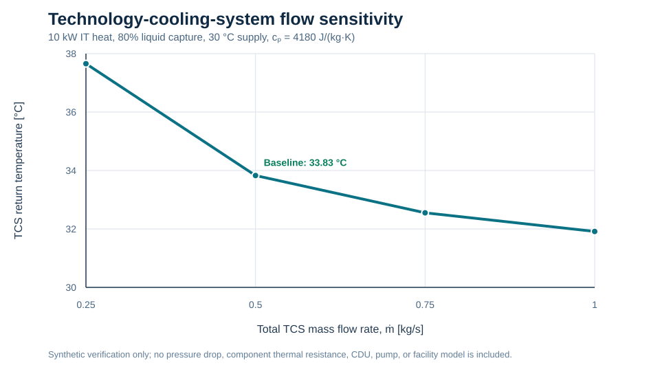

# v0.1 result artifacts

These files are NED3-authored, synthetic verification outputs derived from
`../case.json`. They contain no vendor, licensed, operational, or facility
data. They are not validation data or equipment-performance predictions.

## Baseline

| Quantity | Value | Meaning |
| --- | ---: | --- |
| IT heat | 10,000 W | Declared synthetic rack load |
| Liquid-path heat | 8,000 W | 80% of the declared IT heat |
| Residual-air heat | 2,000 W | Accounted, but not modeled in the liquid control volume |
| TCS temperature rise | 3.82775 K | From \(Q_{liquid}/(\dot m c_p)\) at 0.5 kg/s and 4180 J/(kg K) |
| TCS return temperature | 33.82775 degC | 30 degC supply plus the calculated rise |
| Rack energy residual | 0 W | Closure of the declared two-path heat partition |

`canonical_steady_state_result.json` records the canonical case SHA-256 and
the full machine-readable baseline.

## Flow sensitivity

`flow_sensitivity.csv` varies only total TCS mass flow from 0.25 to 1.0 kg/s.
It demonstrates the expected inverse relation between flow and liquid-side
temperature rise while holding the 8 kW liquid heat load and all other v0.1
inputs fixed. It is a conservation sanity check, not a hydraulic or
component-thermal prediction.

## MATLAB cross-implementation check

`matlab_cross_implementation_comparison.json` records the R2025b MATLAB
calculation against the Python reference. The maximum absolute difference is
zero for all seven shared quantities at a tolerance of \(10^{-10}\). Because
both implementations evaluate the same declared steady equation, this is an
implementation-consistency result only; it is not independent model-form or
experimental validation.
