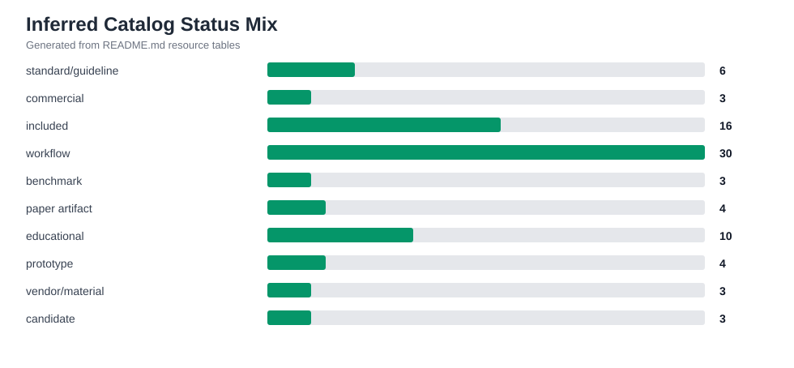
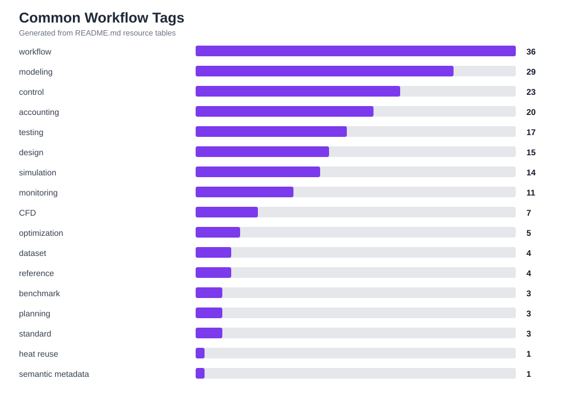
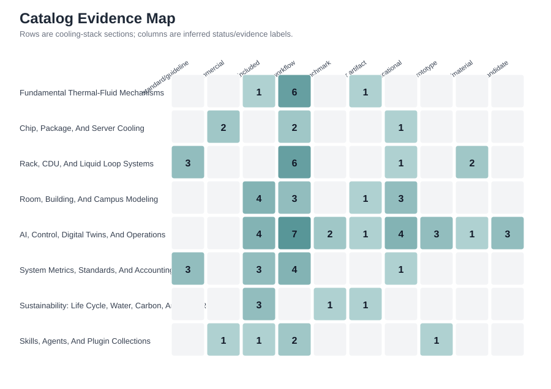

# Catalog Trends And Coverage

This page summarizes what the current catalog says about the data center cooling research-tool landscape. The figures are generated from `README.md`, while the interpretation also uses the June 20, 2026 review pass in [review-log-2026-06-20.md](review-log-2026-06-20.md), the June 21, 2026 review-revision pass in [review-log-2026-06-21.md](review-log-2026-06-21.md), the June 22, 2026 review-revision pass in [review-log-2026-06-22.md](review-log-2026-06-22.md), the June 23, 2026 review-revision pass in [review-log-2026-06-23.md](review-log-2026-06-23.md), the June 24, 2026 review-revision pass in [review-log-2026-06-24.md](review-log-2026-06-24.md), the June 25, 2026 review-revision pass in [review-log-2026-06-25.md](review-log-2026-06-25.md), the June 26, 2026 review-revision pass in [review-log-2026-06-26.md](review-log-2026-06-26.md), the June 27, 2026 review-revision pass in [review-log-2026-06-27.md](review-log-2026-06-27.md), the June 28, 2026 review-revision pass in [review-log-2026-06-28.md](review-log-2026-06-28.md), the June 29, 2026 review-revision pass in [review-log-2026-06-29.md](review-log-2026-06-29.md), the June 30, 2026 review-revision pass in [review-log-2026-06-30.md](review-log-2026-06-30.md), the July 1, 2026 review-revision pass in [review-log-2026-07-01.md](review-log-2026-07-01.md), the July 2, 2026 review-revision pass in [review-log-2026-07-02.md](review-log-2026-07-02.md), the July 3, 2026 review-revision pass in [review-log-2026-07-03.md](review-log-2026-07-03.md), the July 4, 2026 review-revision pass in [review-log-2026-07-04.md](review-log-2026-07-04.md), the July 5, 2026 review-revision pass in [review-log-2026-07-05.md](review-log-2026-07-05.md), the July 6, 2026 review-revision pass in [review-log-2026-07-06.md](review-log-2026-07-06.md), and the July 20, 2026 review-revision pass in [review-log-2026-07-20.md](review-log-2026-07-20.md).

## Generated Coverage Figures








## Main Trends

| Trend | Evidence in the catalog | Engineering implication | Curation action |
| --- | --- | --- | --- |
| Direct-to-chip and rack liquid cooling are moving from hardware descriptions toward reusable specifications and reference tools. | OCP cooling environments, OCP cold-plate work, OCP OAI liquid-cooling guidelines, Dell IRC reference tools, vendor CDU material. | Researchers should track pressure drop, coolant temperature, leak response, serviceability, and material compatibility alongside heat-transfer metrics. | Keep specification links and hardware-reference tools separate from validated thermal models. |
| Control benchmarks are converging around Gymnasium, FMUs, Modelica, and RL/agent interfaces. | SustainDC, AlphaDataCenterCooling, Sustain-LC, CompOpt, C2G-Bench, EnergyPlus/Sinergym examples. | Cooling research is increasingly coupled to workload scheduling, carbon signals, water use, and grid services. | Require control candidates to document observations, actions, constraints, reward terms, and thermal-safety limits. |
| Geo-distributed AI scheduling benchmarks are adding HVAC and thermal proxies. | A July 20 source check found HPE SustainCluster, a Gymnasium-compatible benchmark with Alibaba GPU traces, weather, electricity-price, carbon-intensity, transfer-cost data, physics-informed datacenter models, and optional HVAC RL control. | Data-center cooling catalogs should distinguish facility-local cooling control from multi-site workload scheduling that includes cooling and weather proxies. | Keep SustainCluster in the candidate queue until a smallest evaluation/test run, data-license review, and thermal/HVAC assumption review are recorded. |
| Paper-described benchmarks are expanding faster than public reusable artifacts. | LC-Opt and DataCenterGym describe Gymnasium-compatible environments for liquid-cooling control and physics-grounded scheduling, but public code/model/data links were not confirmed in the June 26 source check. | Manuscript discussion can cite these as landscape signals, while the catalog should wait for reusable artifacts before treating them as tools. | Keep a watchlist for paper-described benchmarks and promote only when public artifacts, inputs, outputs, and validation limits are inspectable. |
| Candidate review state now needs its own signal. | The June 27 review found three README candidates that had been inspected but were still reported as unreviewed by the generated validation signal. | A candidate can be screened and still remain low-confidence; treating it as unreviewed hides what has already been checked and makes recurring review comments less actionable. | Use `screened low-confidence candidate` for dated candidates with thin public artifacts, and reserve `unreviewed candidate` for entries that still need first-pass inspection. |
| Validation debt needs execution readiness, not only a queue. | The June 29 generator now emits `validation_execution_matrix.md`, which separates benchmark smoke tests, paper-artifact matching, semantic validation, local code tests, notebook/data review, vendor follow-up, and source-identification work. | Maintainers can now choose validation work based on what is actually executable in the current environment instead of repeatedly noting that many resources are not run. | Track `ready:`, `blocked:`, and manual-review counts across daily runs, and use the matrix before adding another batch of candidates. |
| Validation debt also needs aging, demotion, and non-applicability decisions. | The June 30 generator now emits `validation_debt_report.md`, the unlinked Smart Cooling Library item was removed from the main README after two dated failed source searches, and the July 1 review reclassified `2listic/datacenter-planner` as layout visualization rather than thermal-validation debt. | A source-missing, repeatedly not-run, or non-thermal entry should not remain in the validation queue indefinitely just because it was once plausible. | Close stale ready items with observed evidence; if evidence cannot be obtained, demote, reclassify, or mark thermal validation not applicable with a dated source-inspection note. |
| Educational controls and simple thermal models need assumption-level source inspection before smoke tests. | The July 1 review refreshed source-inspection notes for `4g/dcool`, `Jalaljalili/Cooling-Dynamic-Model`, and `Lucabr01/RL-and-Gradient-Free-Based-Datacenter-Cooling-Controller`, distinguishing toy RL framing, RC/PID teaching models, and Sinergym/EnergyPlus training studies. | Some stale queue items can be narrowed before execution by recording equations, actions, rewards, comfort bounds, dependencies, and missing validation. | Keep educational/prototype entries visible, but update their reviewed dates only when the note records what was inspected and what still remains unrun. |
| Source-inspected closures need their own run-status state. | The July 2 review refreshed `vk22006/predictive-cooling-optimizer-for-data-centers` and `eeyx1/cooling-fan-predictive-maintenance-digital-twin` with dated source-inspection notes, then updated the generator so source-inspected rows are counted separately from untouched not-run items. | Code/README inspection can close an educational/prototype scope question without proving executable reproducibility. | Use `Run status: source inspected, local run not performed` when source evidence is enough to narrow scope but no local command has been run. |
| Hardware and IoT prototypes need a manual validation track. | The July 3 review refreshed `SohelHossain1218/Smart-IoT-Data-Center-Cooling-Environment-Monitor` and updated the generator to classify sensor, relay, Arduino/ESP, and other hardware-dependent rows as `hardware-in-loop/manual check` rather than generic local-code smoke tests. | A firmware, sensor, relay, or field-safety claim cannot be closed by README inspection alone; it needs compile/upload, calibration, bench, or field-test evidence. | Use `Run status: source inspected, hardware-in-loop validation not performed` until hardware evidence is recorded. |
| Benchmark source inspection should not erase execution debt. | The July 4 review refreshed SustainDC and Sustain-LC source details while updating the generator to count source-inspected benchmark rows that still require execution. | A benchmark can be scoped from README/code inspection, but reproducibility still requires dependency setup, a command, a configuration, and output metrics. | Keep source-inspected benchmarks in ready execution buckets until command-level evidence is recorded. |
| Queue closure now needs a minimum evidence packet. | The July 5 generator emits `validation_runbook.md`, keeps source-inspected public-code and paper-artifact workflows execution-required, and reclassifies `NSTuttle/EfficiencyCalculatorWeb` as blocked after common entry-point probes failed. | Reviewers can now distinguish source inspection, missing-entry evidence, Docker/API smoke-test requirements, notebook reproduction, and benchmark metrics instead of repeating a generic validation-debt critique. | Use the runbook's probe template, evidence packet, and "Do not close with" column before changing a queued row's status. |
| Queue closure also needs a finite daily target. | The July 6 generator emits `validation_next_actions.md`, which ranks stale `ready:` rows, high-priority caveats, and blockers into an eight-item closure batch. | Recurring reviews can now focus on a small actionable batch rather than rediscovering that the full validation queue is large. | Close or reclassify at least one selected next-action item before adding more candidates. |
| The refresh environment itself is now part of reproducibility. | The July 20 review found that the default sandbox command path does not expose `python`, `py -3` points to an unavailable Windows Store interpreter, profile-loaded PowerShell exposes Anaconda Python 3.9.12, and TeX executables are missing. | A reproducible catalog needs both generated artifacts and a clear record of which shell environment can actually run the generator. | Run `scripts/check_runtime_prereqs.ps1` before refresh work on Windows; do not change generated catalog counts unless the generator actually runs or the manual update is explicitly documented. |
| Facility-scale tools now need water, carbon, heat reuse, and site-stress metrics in addition to PUE. | PUE, WUE, Water Usage Impact, ERE/heat reuse workflows, data center water research links, EnergyPlus/Modelica facility models. | PUE alone can hide water tradeoffs, heat-reuse effects, and boundary-condition problems. | Prefer entries that state accounting boundaries and include weather, water, and load assumptions. |
| AI data center guidance is moving toward integrated energy, water, grid, commissioning, and retrofit framing. | ASHRAE data center resources and the PNNL/ASHRAE/NEMA AI Data Center Energy Performance Framework are now tracked as guidance context. | Cooling-tool studies should identify whether they support planning, design, commissioning, operations, retrofit, or grid-interactive use cases. | Keep framework/guidance sources separate from runnable tools and validation datasets. |
| High-temperature fully liquid-cooled AI factory references are becoming system-level design signals. | NVIDIA DSX documentation and NVIDIA's June 21, 2026 liquid-cooling article describe 45 C inlet context, dry-cooler/chiller implications, DSX Sim, DSX Exchange, grid response, and generation-specific facilities reference designs. | Researchers should report coolant inlet temperature, dry-cooler/chiller assumptions, facility water accounting, heat-reuse temperature grade, and IT/OT signal boundaries. | Track DSX as vendor/reference-design context; require independent data before citing performance claims as evidence. |
| Digital twins are shifting from visualization toward calibrated and operationally constrained models. | CFDTwin, Sustain-LC, AlphaDataCenterCooling, fan predictive-maintenance twin, rack cooling digital-twin candidates. | A useful twin must state calibration data, uncertainty, update rate, actuation limits, and failure modes. | Mark minimal-readme digital twin repos as candidates until validation and data flow are clear. |
| Operationally validated liquid-cooling optimization is becoming a clearer benchmark target. | 2026 arXiv studies on Frontier report Modelica/digital-twin validation, year-long 10-minute operational data, ASHRAE Guideline 14 style validation, CDU/subloop co-design analyses, and life-cycle co-design with cost, carbon, and reliability terms. | Catalog entries for control and digital twins should be judged against whether they disclose data resolution, thermal safety limits, actuator constraints, model error, transferability, and life-cycle assumptions. | Track these papers as validation signals, but do not list them as reusable tools unless code or public data become available. |
| Server thermal setpoint optimization is becoming device-aware rather than simply "cooler is better." | A June 2026 arXiv study reports inverse-temperature-dependence behavior in production Intel Xeon CPUs and energy savings from ITD-aware thermal grouping and inlet-temperature adjustment. | Cooling controls should model the coupled IT-power and thermal response of specific hardware, not only facility fan/pump/chiller power. | Add device-aware thermal setpoint datasets or tools when public artifacts become available. |
| Safety-aware digital-twin control is becoming a distinct research requirement. | DCVerse reports a dual-loop framework that uses a digital twin and a policy reservoir to pre-evaluate DRL policies before deployment on a real-world cooling system. | Benchmark entries should identify whether candidate controllers are only optimized in simulation or also include pre-deployment safety checks, expert verification, and SLA violation tracking. | Keep paper-described platforms separate from public tools unless code, data, or reusable scenarios are available. |
| Semantic models and operational metadata are becoming a practical need for liquid-cooling digital twins. | Visum-ai/aif-ops extends Brick-style semantics with CDUs, cold plates, RDHx, manifolds, immersion tanks, GPU racks, procedures, failure modes, interlocks, lockout/tagout steps, maintenance tasks, and commissioning metadata. | Digital twins need structured equipment, procedure, and failure-mode context before controls can be audited, handed off, or integrated with operations. | Track ontology and SHACL resources as metadata workflows; run minimal validation graphs before treating them as interoperable tooling. |
| Open operations telemetry is becoming a bridge between cooling hardware and workload-aware control. | densewatch adds a read-only Redfish/Modbus CDU exporter, conformance probe, zero-hardware simulator, topology correlation, and Grafana dashboards for GPU-job, rack-power, and CDU thermal attribution. | Cooling digital twins and control studies need trustworthy telemetry joins before reward functions or optimization results can be interpreted. | Treat telemetry/correlation tools as workflow infrastructure; require local demos, real-CDU conformance reports, and schema-version checks before claiming operational validation. |
| Redfish liquid-cooling schemas are now a first-class operations reference. | DMTF DSP2064 version 1.1.0 describes Redfish support for CDUs, immersion units, heat exchangers, cooling loops, coolant connectors, leak detection, pumps, reservoirs, thermal metrics, Facility, and ThermalEquipment resources. | Telemetry and conformance workflows should cite the liquid-cooling schema guidance rather than relying only on repository-specific Redfish wording. | Keep DSP2064 as a standard/guideline source and require service-validator or real-device evidence before claiming endpoint conformance. |
| AI cooling-control pilots are moving toward indirect server thermal-state prediction. | The Daikin/NTT DATA July 2026 PoC will evaluate AI prediction of server thermal state from indirect server power and temperature data, linked to HVAC, chiller, and liquid-cooling system control. | Tool reviews should ask whether controls use rack ambient sensors, server-internal telemetry, indirect thermal-state estimators, or coupled facility/IT signals. | Track the PoC as an operations trend signal, not a reusable tool, until public model details, validation data, or artifacts are available. |
| Experimental mechanism tools remain essential for validating high-density cooling designs. | BubbleID, BubbleID-Flow, FlowLab, AELab, IR thermography, acoustic emission, boiling and droplet workflows. | Facility and control models still need physically grounded heat-transfer and two-phase-flow evidence. | Preserve mechanism-level tools even when the repository audience is facility-scale. |

## Fresh Source Checks On 2026-06-21

| Source | What changed or mattered | Curation implication |
| --- | --- | --- |
| [ASHRAE Data Center Resources](https://www.ashrae.org/technical-resources/bookstore/datacom-series) | The current page lists ANSI/ASHRAE Standard 90.4-2025, data-center testing guidance, datacom resources, liquid-cooling white papers, and data-center CFD/control articles. | Keep ASHRAE as a standard/guideline hub and cite specific standards when claims depend on them. |
| [OCP Cooling Environments](https://www.opencompute.org/community/cooling-environments) and [OCP Cold Plate](https://www.opencompute.org/wiki/Cooling_Environments/Cold_Plate) | The Cooling Environments project explicitly spans cold plates, CDUs, immersion, door heat exchangers, and heat reuse; the Cold Plate page shows active coolant-fluid and specification workstreams. | Treat OCP pages as specification and ecosystem signals, not as validation datasets. |
| [The Green Grid Water Usage Impact announcement](https://www.itic.org/news-events/news-releases/the-green-grid-releases-new-tool-to-help-data-centers-advance-water-efficiency) | The November 3, 2025 WUI release combines water consumption and water stress and is positioned as an extension of WUE. | Keep water accounting separate from PUE and prefer site-stress-aware entries. |
| [Machine Learning Guided Cooling System Optimization for Data Center](https://arxiv.org/abs/2601.02275) | Uses one year of 10-minute Frontier data and a physics-guided surrogate to identify cooling energy waste. | Useful benchmark for what transparent operational-data validation should report. |
| [Digital Twin-Based Cooling System Optimization for Data Center](https://arxiv.org/abs/2603.01198) | Reports a Modelica-based Frontier liquid-cooling digital twin validated with one year of 10-minute operational data and ASHRAE Guideline 14 style error metrics. | Digital-twin catalog notes should ask for model error, calibration data, constraints, and actuation limits. |
| [Co-Design Optimization for Data Center Cooling System via Digital Twin](https://arxiv.org/abs/2605.15516) | Evaluates CDU/subloop partitioning and flow/supply-temperature co-design across 49,353 operational timesteps. | Highlights a gap between published validation studies and reusable public datasets/tools. |

## Fresh Source Checks On 2026-06-22

| Source | What changed or mattered | Curation implication |
| --- | --- | --- |
| [PNNL/ASHRAE/NEMA AI Data Center Energy Performance Framework](https://www.ashrae.org/technical-resources/ai-data-center-framework) | The framework page is now tracked as current AI data center energy-performance guidance, not as a standard or validation dataset. | Add it to the catalog as guidance context and keep it separate from runnable tools. |
| [Data Center Life Cycle Co-Design Optimization](https://arxiv.org/abs/2606.15408) | The June 13, 2026 arXiv paper extends Frontier liquid-cooling co-design into life-cycle cost, embodied carbon, and reliability tradeoffs. | Expand manuscript discussion from operational energy optimization toward life-cycle assumptions and reliability constraints. |
| [HewlettPackard/compopt](https://github.com/HewlettPackard/compopt) | Repository documentation describes a pure-Python Gymnasium-style simulator spanning chip, server, rack, CDU, cooling tower, workload scheduling, and energy/water/cost objectives. | Keep as a high-priority candidate until examples, tests, and physical assumptions are independently reviewed. |
| [HewlettPackard/c2g-bench](https://github.com/HewlettPackard/c2g-bench) | Repository documentation exposes liquid-cooled and air-cooled workload traces plus control hooks for grid-interactive operation. | Treat it as a promising benchmark candidate, but require trace provenance, thermal safety limits, and rerun results before using as evidence. |

## Fresh Source Checks On 2026-06-23

| Source | What changed or mattered | Curation implication |
| --- | --- | --- |
| [NVIDIA liquid-cooling AI factories article](https://blogs.nvidia.com/blog/liquid-cooling-ai-factories/) | NVIDIA describes Rubin-generation AI infrastructure using 100% liquid cooling, 45 C coolant, closed-loop operation, dry-cooler potential, and near-zero facility cooling water consumption under favorable climates. | Treat as current vendor/industry direction; do not treat claimed water or energy reductions as independently validated catalog evidence. |
| [NVIDIA DSX documentation](https://docs.nvidia.com/dsx) | DSX documentation now exposes a platform index spanning DSX Sim digital twins, DSX Exchange IT/OT communications, MaxLPS/Flex power features, and facilities reference-design resources with 45 C inlet context. | Add DSX to the catalog as a vendor/reference-design platform and route it to the validation queue. |
| [NVIDIA DSX platform page](https://www.nvidia.com/en-us/data-center/products/dsx/) | NVIDIA positions DSX as a chip-to-grid AI factory design, simulation, operations, and reference-design platform for tokens per watt. | Useful for manuscript framing around integrated power/cooling/operations, but not a substitute for public benchmark data. |

## Fresh Source Checks On 2026-06-24

| Source | What changed or mattered | Curation implication |
| --- | --- | --- |
| [HewlettPackard/compopt](https://github.com/HewlettPackard/compopt) | The public README exposes six Gymnasium environments, chip-to-cooling-tower thermal RC-network structure, documented equations, reward components, baseline agents, example scripts, tests, and configuration presets. | Promote from unreviewed candidate to screened benchmark, but keep the local run-status caveat until an example is executed and metrics are recorded. |
| [HewlettPackard/c2g-bench](https://github.com/HewlettPackard/c2g-bench) | The public README documents a compute-to-grid benchmark with workload, grid, weather, battery, and dual-zone cooling components plus processed trace provenance. | Promote from unreviewed candidate to screened benchmark, but retain a queue item for local execution and trace/data provenance review. |
| [Dual-Loop Control in DCVerse](https://arxiv.org/abs/2604.07559) | The April 8, 2026 arXiv paper reports a digital-twin dual-loop control framework for real-world data center cooling, including DRL policy pre-evaluation and SLA-aware deployment checks. | Add to manuscript/trend discussion as a safety-aware digital-twin signal; do not add as a reusable catalog tool unless public code or scenarios are found. |

## Fresh Source Checks On 2026-06-25

| Source | What changed or mattered | Curation implication |
| --- | --- | --- |
| [JuwanHa/-BETlab-Data-Center-Modeling](https://github.com/JuwanHa/-BETlab-Data-Center-Modeling) | Public repository documentation exposes EnergyPlus data center models for ACDC and LCDC cases, WSE/TES configurations, FWS/TCS liquid-cooling framing, workload-to-cooling-load aggregation, weather files, and linked peer-reviewed ACDC papers. | Add as a screened facility-modeling paper artifact, but keep a queue item for local execution and LCDC artifact/validation-data matching. |
| [Visum-ai/aif-ops](https://github.com/Visum-ai/aif-ops) | Public repository documentation exposes OWL ontology and SHACL shapes for liquid-cooling infrastructure and operations metadata, with a pySHACL validation command and Brick Schema alignment notes. | Add as an ontology/semantic-metadata workflow; require a minimal SHACL validation run before claiming interoperability. |
| [kardashev-lab/datacenter-cooling-sim](https://github.com/kardashev-lab/datacenter-cooling-sim) | The public README documents a Docker Compose integration stack connecting SimAI, AlphaDataCenterCooling, facility simulation, adapters, Prometheus/Grafana, and a dashboard. | Reclassify from unreviewed candidate to screened integration workflow; keep run status open until service health and sample metrics are recorded. |
| [xenabmirza/magnetocaloric-thin-film-cooling](https://github.com/xenabmirza/magnetocaloric-thin-film-cooling) | The public artifact is a small notebook-style magnetocaloric cooling concept with a short README and no visible validation dataset or system integration. | Reclassify from candidate to educational/prototype concept so it remains visible without implying engineering readiness. |
| [kevinanthonypamisetti/ecoData](https://github.com/kevinanthonypamisetti/ecoData) | The public repository is an HTML/JavaScript closed-loop liquid-cooling web demo with live thermal calculations, PUE scoring, and water-use comparison claims. | Keep in the candidate queue rather than the main catalog until assumptions, formulas, validation evidence, and reusable data are reviewed. |

## Fresh Source Checks On 2026-06-26

| Source | What changed or mattered | Curation implication |
| --- | --- | --- |
| [samrudition/dynamic-cooling-loop](https://github.com/samrudition/dynamic-cooling-loop) | Public README exposes a MATLAB/Simulink active liquid-cooling-loop model with lumped-capacity energy balance, effectiveness-NTU heat exchanger relation, setup script, pump-failure scenario, UA-improvement scenario, and a technical report. | Promote as an educational/prototype liquid-loop dynamics model, not as a data-center-validated design tool. |
| [enrique-martinez-martel/collagen](https://github.com/enrique-martinez-martel/collagen) | Public README exposes a MATLAB/Simulink RL training workflow coupled to a 6SigmaRoom data-center model, with MATLAB toolboxes and proprietary 6SigmaRoom software required. | Promote as an educational/prototype AI cooling-control artifact with a proprietary dependency caveat. |
| [LC-Opt](https://arxiv.org/abs/2511.00116) | Paper describes a Frontier-based Modelica/Gymnasium liquid-cooling benchmark spanning cooling towers, cabinets, server blade groups, HRU support, RL, and agentic-AI explanations. | Track as a paper-described benchmark signal; do not add to the main catalog unless public model/code/data artifacts are confirmed. |
| [DataCenterGym](https://arxiv.org/abs/2604.15594) | Paper describes a physics-grounded Gymnasium-compatible simulator coupling compute queueing, building thermal dynamics, localized HVAC, temperature-dependent service degradation, and hierarchical MPC scheduling. | Track as a paper-described simulator signal; promote only if public code or reusable scenarios are found. |
| [Revisiting "Cooler is Better"](https://arxiv.org/abs/2606.11163) | Paper reports inverse-temperature-dependence effects in production Intel Xeon CPUs and energy savings from ITD-aware thermal grouping and inlet-temperature adjustment. | Add device-aware server thermal setpoint optimization as a trend and watch for reusable data or tools. |

## Fresh Source Checks On 2026-06-27

| Source | What changed or mattered | Curation implication |
| --- | --- | --- |
| [rishithayanidhi/Data_Center_Cooling_Optimization_Environment](https://github.com/rishithayanidhi/Data_Center_Cooling_Optimization_Environment) | Public README and code expose an OpenEnv/FastAPI cooling-control environment with zone-temperature observations, cooling-level actions, synthetic workload patterns, simplified thermal dynamics, reward terms, and baseline-agent hooks. | Keep in the main README only as a screened low-confidence candidate until a local run, model assumptions, and validation evidence are recorded. |
| [iaziz6/Digital-Twin-for-Data-Center-Cooling](https://github.com/iaziz6/Digital-Twin-for-Data-Center-Cooling) | Public README is a one-line physics-regularized 3D U-Net rack-cooling digital-twin concept; repository search did not surface model files, data, examples, or paper linkage. | Keep as a low-confidence candidate rather than a digital-twin tool. |
| [xiaodongwang991481/energy_saving](https://github.com/xiaodongwang991481/energy_saving) | Public README is a one-sentence machine-learning energy-saving description; repository search did not surface cooling equations, datasets, examples, or validation evidence. | Keep as a low-confidence candidate and avoid treating it as ML evidence. |
| [AbdulrabDev/data-center-cooling-optimization](https://github.com/AbdulrabDev/data-center-cooling-optimization) | Public files show a Newton-Raphson fan-speed cost-function exercise with `0.001 v^3 + 1000 / v` and classroom-style outputs. | Leave in the candidate queue as screened but not promoted; it is educational numerical-methods material, not a reusable cooling research tool. |

## Fresh Source Checks On 2026-06-28

| Source | What changed or mattered | Curation implication |
| --- | --- | --- |
| [nehemiyawicks/densewatch](https://github.com/nehemiyawicks/densewatch) | Public source inspection found a read-only telemetry stack for GPU-job, rack-power, and CDU/liquid-cooling correlation, including Redfish DSP2064 CoolingUnit scraping, Modbus fallback profiles, a conformance probe, zero-hardware simulators, Docker Compose demo, Grafana dashboards, and tests. | Add as a screened operations telemetry workflow, not as validated facility evidence; queue a local demo or real-CDU conformance report. |
| [michaillogothetis/datacenter-cooling-cfd](https://github.com/michaillogothetis/datacenter-cooling-cfd) | Public README reports ANSYS Discovery 2024 steady-state CFD for a 1U server and includes result snapshots, but reusable simulation setup, mesh details, and validation evidence were not confirmed. | Keep as a candidate or educational CFD artifact until model files and validation basis are clearer. |
| [Pepperingomtang/Datacenter-D2C-FreeCooling-Korea](https://github.com/Pepperingomtang/Datacenter-D2C-FreeCooling-Korea) | Public README describes a Korean 40 MW water-cooled data center free-cooling suitability notebook using hourly weather data, 3E analysis, and comparison files. | Keep as a candidate climate/site-screening workflow pending assumptions, equations, data-license, and result reproduction review. |
| Smart Cooling Library | Fresh web search did not confirm a canonical source URL for the unlinked README row. | Keep it as an explicit source-identification task and let the generated validation queue surface the missing URL instead of hiding the row. |

## Fresh Source Checks On 2026-06-29

| Source | What changed or mattered | Curation implication |
| --- | --- | --- |
| [c50346867/data-center-pue-optimizer](https://github.com/c50346867/data-center-pue-optimizer) | Public source inspection found a synthetic data generator, LightGBM PUE predictor, rule-based cooling optimizer, Streamlit dashboard, FastAPI interface, demo command, and unit tests. | Add as an educational PUE/control artifact, not as facility validation; route it to a test-suite or example smoke test. |
| [Pepperingomtang/Datacenter-D2C-FreeCooling-Korea](https://github.com/Pepperingomtang/Datacenter-D2C-FreeCooling-Korea) | README describes Korean D2C free-cooling site screening with weather data and 3E outputs, while the notebook header states that some free-cooling transition and EPW-linkage logic is not implemented in that file section. | Keep as a candidate until implementation state, assumptions, equations, data licensing, and reproduced outputs are reconciled. |
| [zheng324-web/data-center-cooling-lowcarbon-policy-sim](https://github.com/zheng324-web/data-center-cooling-lowcarbon-policy-sim) | Repository exists, but README fetch returned not found and code search did not surface model details during this pass. | Keep as low-confidence candidate; do not cite or promote before files and assumptions are inspectable. |

## Fresh Source Checks On 2026-06-30

| Source | What changed or mattered | Curation implication |
| --- | --- | --- |
| Smart Cooling Library | A second dated source-identification search did not confirm a canonical repository, documentation page, paper, or standard for the unlinked Modelica cooling-library row. | Remove from the main README and retain only in the candidate/source-missing table until a source can be inspected. |
| [Emi2608/liquid-cooling-system-simulation](https://github.com/Emi2608/liquid-cooling-system-simulation) | Public page inspection shows a very small AI liquid-cooling simulation repository with app/model/scaler files but no visible README, equations, training-data provenance, or validation description. | Keep as a candidate or educational/prototype signal; do not promote without model provenance and a runnable example review. |

## Fresh Source Checks On 2026-07-01

| Source | What changed or mattered | Curation implication |
| --- | --- | --- |
| [2listic/datacenter-planner](https://github.com/2listic/datacenter-planner) | Public page inspection found a Paper.js/Three.js/Vite layout app with npm/Vite run instructions, not a thermal, airflow, hydraulic, or energy model. | Reclassify as layout visualization and remove it from thermal-validation debt. |
| [4g/dcool](https://github.com/4g/dcool) | Public page inspection and targeted web search found RL framing and toy simulation material, but no independent validation source, reusable facility dataset, or reproduced run. | Retain as an explicitly unvalidated control example with a dated search note. |
| [Jalaljalili/Cooling-Dynamic-Model](https://github.com/Jalaljalili/Cooling-Dynamic-Model) | Public page inspection found an RC thermal transfer-function model, PID/Bode/step-response demonstrations, interactive run path, disturbance handling, actuator limits, and future-work notes. | Keep as educational source-inspected RC/PID material; local run remains open. |
| [Lucabr01/RL-and-Gradient-Free-Based-Datacenter-Cooling-Controller](https://github.com/Lucabr01/RL-and-Gradient-Free-Based-Datacenter-Cooling-Controller) | Public page inspection found Sinergym/EnergyPlus setup details, CRAC setpoint action bounds, thermal-comfort thresholds, reward shaping, SAC curriculum, and evolutionary-strategy framing. | Keep as educational EnergyPlus/Gymnasium control material; local reproduction remains open. |

## Fresh Source Checks On 2026-07-02

| Source | What changed or mattered | Curation implication |
| --- | --- | --- |
| [vk22006/predictive-cooling-optimizer-for-data-centers](https://github.com/vk22006/predictive-cooling-optimizer-for-data-centers) | Public page inspection found an educational predictive-control dashboard with HVAC sample preprocessing, engineered lag/rolling/cyclical/interaction features, XGBoost energy and temperature models, constraint-based optimization, reported tests, and a Streamlit command. | Keep as source-inspected educational predictive-control material; treat model scores as reported project results until data provenance and local execution are verified. |
| [eeyx1/cooling-fan-predictive-maintenance-digital-twin](https://github.com/eeyx1/cooling-fan-predictive-maintenance-digital-twin) | Public page inspection found an ESP32/MQTT/Python/Flask maintenance twin with simulated validation summaries, synthetic-data generation, training, replay, database validation, dashboard, and AI-report commands. The repository says generated/raw data and trained model binaries are excluded and real labelled fan-fault validation remains future work. | Keep as source-inspected prototype operational-twin infrastructure, not as field-validated cooling-maintenance evidence. |

## Fresh Source Checks On 2026-07-03

| Source | What changed or mattered | Curation implication |
| --- | --- | --- |
| [D1D104/fuzzy-miso-datacenter-cooling](https://github.com/D1D104/fuzzy-miso-datacenter-cooling) | GitHub source inspection found a Mamdani fuzzy CRAC controller with error and error-derivative inputs, a 25-rule matrix, CRAC power output, a first-order simulated temperature update, MQTT/Node-RED telemetry, and alert logic. | Refresh as source-inspected control-teaching material; local execution and facility calibration remain open. |
| [SohelHossain1218/Smart-IoT-Data-Center-Cooling-Environment-Monitor](https://github.com/SohelHossain1218/Smart-IoT-Data-Center-Cooling-Environment-Monitor) | GitHub source inspection found an ESP8266/NodeMCU server-room monitor with temperature, humidity, air-quality, smoke, OLED, relay, Telegram, EEPROM, and NTP features. | Route to hardware-in-loop/manual validation instead of local Python-style smoke testing. |
| [femmetronics/Data-Center-Cooling-System](https://github.com/femmetronics/Data-Center-Cooling-System) | GitHub source inspection found an educational Python sustainability model connecting cooling towers, evaporative air cooling, dry coolers, water accounting, carbon, wet-bulb assumptions, and flexible workload scheduling. | Keep as educational facility/accounting material; illustrative WUE functions and sample totals are not calibrated evidence. |
| [ME421-Capstone-Project/chiller-model](https://github.com/ME421-Capstone-Project/chiller-model) | GitHub source inspection found a Python chiller-array package with thermal-interference, COP, aging, ramp, optimization, tests, docs, and examples. | Refresh as source-inspected educational facility-model material; local install/test and empirical validation remain open. |
| [p26412/ThermoFOAM-DC](https://github.com/p26412/ThermoFOAM-DC) | Fresh GitHub search found an OpenFOAM room-CFD/hotspot workflow with a ten-case v0.2 matrix, but the README currently includes merge-conflict markers. | Keep as a candidate until repository hygiene and reproducible output checks are complete. |
| [A Scalable Digital Twin Framework for Energy Optimization in Data Centers](https://arxiv.org/abs/2605.05581) | Fresh arXiv search found a May 7, 2026 IoT/cloud/LSTM digital-twin paper evaluated in a controlled small-scale data-center environment. | Track as a constrained digital-twin signal; do not catalog as a reusable tool without public artifacts. |

## Fresh Source Checks On 2026-07-04

| Source | What changed or mattered | Curation implication |
| --- | --- | --- |
| [HewlettPackard/dc-rl](https://github.com/HewlettPackard/dc-rl) | Public source inspection found SustainDC's Gymnasium/MARL structure, workload scheduling, cooling and battery environments, train/evaluation scripts, configurable workload/weather/carbon inputs, and documented observation/action spaces. | Refresh as source-inspected benchmark material, but keep benchmark execution open until a minimal command records configuration and output metrics. |
| [HewlettPackard/sustain-lc](https://github.com/HewlettPackard/sustain-lc) | Public source inspection found a Frontier-style FMU, environment setup, train scripts, pretrained-policy folders, evaluation notebooks, policy distillation, PyFMI co-simulation context, and CDU control variables. | Refresh as source-inspected liquid-cooling benchmark material, while keeping command-level execution evidence required. |
| [samrudition/dynamic-cooling-loop](https://github.com/samrudition/dynamic-cooling-loop) | Public source inspection found the lumped-capacity and effectiveness-NTU formulation, MATLAB setup script, Simulink model, technical report, base 1 kW case, pump-failure flow drop, and UA-improvement scenario. | Keep as an educational liquid-loop dynamics model with source-inspected scope; local Simulink execution remains optional for deeper reproducibility. |
| [enrique-martinez-martel/collagen](https://github.com/enrique-martinez-martel/collagen) | Public source inspection found MATLAB/Simulink/Simscape/RL dependencies, a live-script training workflow, `collagenSim.slx`, `RLsetupRun.mlx`, and a proprietary 6SigmaRoom data-center model artifact. | Keep as an educational AI cooling-control project; do not treat it as reproducible benchmark evidence without licensed dependencies and validation data. |
| [xenabmirza/magnetocaloric-thin-film-cooling](https://github.com/xenabmirza/magnetocaloric-thin-film-cooling) | Public source inspection confirmed a notebook-only two-commit magnetocaloric concept without visible validation data, material-property provenance, benchmark output, or data-center system integration. | Retain as an emerging-cooling educational concept rather than chip/package or facility evidence. |

## Fresh Source Checks On 2026-07-06

| Source | What changed or mattered | Curation implication |
| --- | --- | --- |
| [DMTF Redfish for Liquid Cooling Equipment DSP2064 v1.1.0](https://www.dmtf.org/sites/default/files/standards/documents/DSP2064_1.1.0.pdf) | The public DMTF white paper covers Redfish schema support for cooling distribution units, immersion cooling units, heat exchangers, facility cooling loops, CoolingUnit, CoolingLoop, CoolantConnector, LeakDetection, Pump, Reservoir, Sensor, ThermalMetrics, ThermalSubsystem, ThermalEquipment, and Facility resources. | Add as a standards/guidance row for rack/CDU/liquid-loop telemetry and conformance framing; do not treat it as performance data or endpoint validation. |
| [DMTF Redfish standards page](https://www.dmtf.org/standards/redfish) | The current Redfish release table lists Redfish 2026.1 publications dated May 17, 2026 and links DSP2064 as "Redfish for Liquid Cooling Equipment". The same page lists DMTF-led validator, conformance, mockup, and service-validator tools. | Use DMTF standards pages as the stable source for schema version checks and future conformance-tool candidates. |

## Fresh Source Checks On 2026-07-20

| Source | What changed or mattered | Curation implication |
| --- | --- | --- |
| [HewlettPackard/sustain-cluster](https://github.com/HewlettPackard/sustain-cluster) | Public source inspection found a Gymnasium-compatible sustainable scheduling benchmark for geo-distributed data centers with Alibaba GPU traces, Open-Meteo weather, Electricity Maps carbon data, electricity-price data, cloud transfer costs, 15-minute scheduling, physics-informed datacenter models, HVAC proxy terms, training/evaluation scripts, and optional local HVAC RL control. | Add to `docs/candidate-repos.md` rather than the main README until command-level execution, data-license review, and thermal/HVAC assumption review are recorded. |
| [Daikin and NTT DATA AI-driven cooling optimization PoC](https://www.daikin.com/press/2026/20260706) | Official source reports a July 2026 to March 2027 validation plan for AI-based server thermal-state prediction and integrated control of HVAC, chiller, and liquid-cooling systems. | Treat as an operations trend signal and a future validation-results watch item, not as an open benchmark or catalog tool. |
| [Strategies and design for increasing AI sustainability](https://www.nature.com/articles/s44359-026-00195-w) | The July 9, 2026 review highlights carbon, water, embodied-emissions, grid, and scheduling tradeoffs for AI data centers. | Strengthen catalog screening toward water/carbon/grid/life-cycle boundary disclosure instead of PUE-only evaluation. |

## Gaps To Fill

| Gap | Why it matters | Candidate search direction |
| --- | --- | --- |
| Open cold-plate pressure-drop and thermal-resistance benchmark data | Direct-to-chip design decisions need comparable component-level evidence. | OCP cold-plate specs, vendor-independent test fixtures, academic datasets. |
| Validated CDU and coolant-loop dynamic models | Controls and grid-interactive studies depend on thermal inertia and pump/valve dynamics. | Modelica Buildings, FMU benchmarks, ORNL/HPE/DOE artifacts. |
| Explicit validation/run/data metadata for every linked catalog row | Generated labels are stronger when they preserve what was checked, what was run, and what artifact is public. | Continue filling `Validation basis`, `Run status`, `Artifact status`, and `Reviewed` tokens during each promotion pass. |
| Candidate review-state separation | Recurring automation comments can persist when screened candidates are still reported as unreviewed. | Keep generated validation signals separate for `unreviewed candidate` and `screened low-confidence candidate`. |
| Runnable validation of high-priority entries | The catalog now has enough metadata to identify which public-code, candidate, vendor, and benchmark entries need execution or deeper artifact matching. | Use [generated/validation_review_queue.md](generated/validation_review_queue.md) to close a small number of queue items during each refresh. |
| Source-inspected but unexecuted rows | Some stale educational/prototype rows can be scoped from README/code inspection, but they still lack local command output. | Use source-inspected run status only for scope closure; use local smoke-test status only when a command, input, and output are recorded. |
| Hardware-in-loop prototype validation | IoT cooling monitors and relay/actuator examples can be useful but need firmware, sensor, and safety evidence before any real-facility implication is made. | Track bill of materials, firmware compile/upload, sensor calibration, relay safety, bench tests, and field-trial conditions separately from local script smoke tests. |
| Execution readiness for queued entries | A queue item can be runnable, blocked by missing source, blocked by vendor evidence, or suited only to manual review. | Use [generated/validation_execution_matrix.md](generated/validation_execution_matrix.md) to pick validation work with a realistic closure artifact. |
| Minimum evidence packets for queued entries | Source inspection can narrow a row but should not close benchmark, paper-artifact, semantic, or public-code workflow debt by itself. | Use [generated/validation_runbook.md](generated/validation_runbook.md) to record probe commands, configurations, outputs, pass/fail results, or dated blocking evidence. |
| Finite daily validation closure target | Large queues lead recurring reviews to repeat the same validation-debt critique. | Use [generated/validation_next_actions.md](generated/validation_next_actions.md) to pick one ranked stale ready row or blocker to close before adding more candidates. |
| Aging visibility for validation debt | Recurring review comments are more useful when they identify stale ready items rather than repeating a general not-run critique. | Use [generated/validation_debt_report.md](generated/validation_debt_report.md) to close, demote, reclassify, or mark non-applicable old ready items before adding more candidates. |
| Public artifacts for paper-described benchmarks | LC-Opt and DataCenterGym describe relevant reusable environments, but artifact availability was not confirmed during the June 26 source check. | Search for code/model/data releases tied to paper-described benchmarks before adding them to the main README. |
| Device-aware IT-power and thermal setpoint datasets | ITD-aware optimization suggests that facility setpoints can affect server power non-monotonically. | Watch for public CPU/GPU thermal characterization datasets and tools that connect inlet temperature to IT power, reliability, and cooling energy. |
| Semantic/operational metadata validation | Digital twins, safety workflows, and liquid-cooling handoff need machine-checkable equipment, procedure, and failure-mode context. | Brick extensions, SHACL shapes, DCIM ontologies, Redfish/Modbus mapping examples, minimal conforming instance graphs. |
| CDU telemetry conformance and workload-to-cooling joins | Operations-facing twins and controllers depend on whether actual CDU interfaces expose usable cooling telemetry and whether GPU jobs can be attributed to rack/CDU thermal load. | Redfish DSP2064 conformance probes, Modbus/BACnet/SNMP profile libraries, NetBox topology joins, Prometheus/Grafana examples, real hardware reports. |
| Negated data-availability language in generated tags | Phrases such as "not a public performance dataset" can otherwise look like positive dataset signals in generated workflow tags. | Keep the dataset-tag heuristic and quality gate aligned with negation handling, then spot-check affected rows after regeneration. |
| Immersion cooling datasets and material-compatibility tools | Immersion introduces dielectric-fluid, maintenance, and reliability questions not captured by air-cooling models. | Peer-reviewed artifacts, standards, vendor-neutral test protocols. |
| Water-impact accounting tied to local water stress | Water-efficient cooling depends on both consumption and watershed context. | WUE/WUI tools, water-stress datasets, cooling-tower makeup/blowdown models. |
| Reproducible workload plus thermal traces for AI/HPC racks | RL and digital-twin work needs realistic workload, power, and coolant-temperature dynamics. | HPC trace datasets, telemetry pipelines, rack-level monitoring tools. |

## How To Regenerate

```bash
python scripts/build_catalog_assets.py
```

The generated CSV is [generated/catalog_resources.csv](generated/catalog_resources.csv). Use it for quick filtering, but edit `README.md` as the source of truth.
